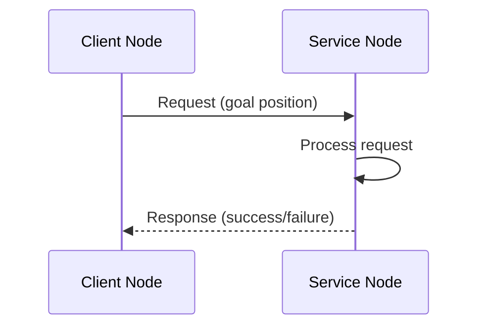
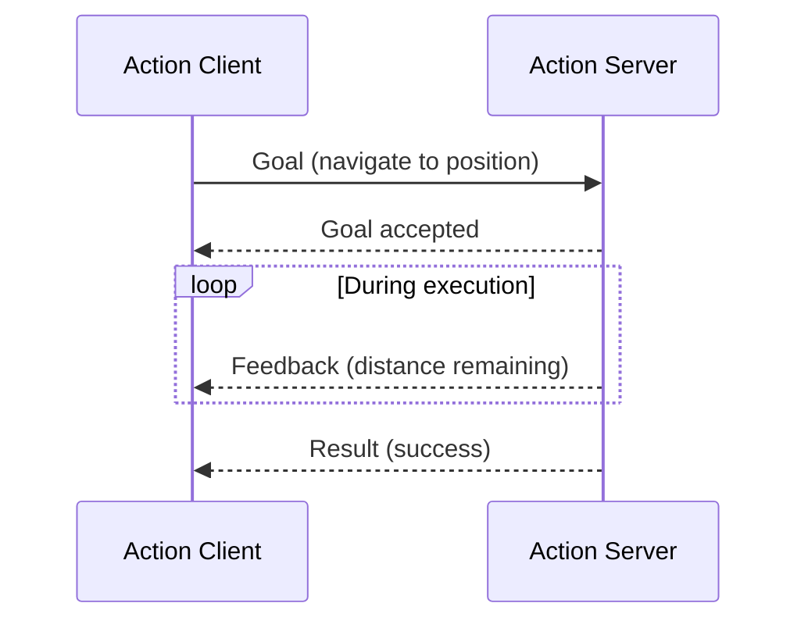
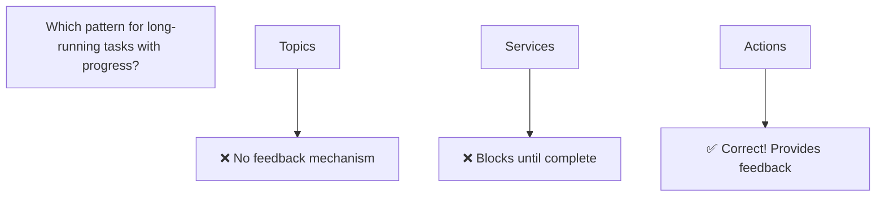

# ROS 2 Architecture: The Robotic Nervous System

:::tip Learning Objective
Understand the core communication patterns in ROS 2 that enable distributed robot control.
:::

## Introduction

**ROS 2 (Robot Operating System 2)** is not an operating system—it's middleware that provides the communication infrastructure for robot software. Think of it as the **nervous system** of a humanoid robot.

```mermaid
graph TB
    subgraph "ROS 2 Communication"
        N1[Sensor Node] -->|publishes| T1[/camera/image]
        N2[Perception Node] -->|subscribes| T1
        N2 -->|publishes| T2[/detected_objects]
        N3[Planning Node] -->|subscribes| T2
        N3 -->|calls| S1[/move_arm]
        N4[Arm Controller] -->|provides| S1
    end
```

## Core Concepts

### 1. Nodes

A **node** is an executable that performs a specific task.

```python
import rclpy
from rclpy.node import Node

class MinimalNode(Node):
    """A minimal ROS 2 node."""
    
    def __init__(self):
        super().__init__('minimal_node')
        self.get_logger().info('Node started!')

def main():
    rclpy.init()
    node = MinimalNode()
    rclpy.spin(node)
    node.destroy_node()
    rclpy.shutdown()

if __name__ == '__main__':
    main()
```

### 2. Topics

**Topics** enable publish-subscribe communication:

```mermaid
graph LR
    P[Publisher Node] -->|message| T[/topic_name]
    T -->|message| S1[Subscriber 1]
    T -->|message| S2[Subscriber 2]
```

```python
from std_msgs.msg import String

class PublisherNode(Node):
    def __init__(self):
        super().__init__('publisher_node')
        self.publisher = self.create_publisher(String, 'robot_status', 10)
        self.timer = self.create_timer(1.0, self.publish_status)
    
    def publish_status(self):
        msg = String()
        msg.data = 'Robot operational'
        self.publisher.publish(msg)
        self.get_logger().info(f'Published: {msg.data}')
```

### 3. Services

**Services** provide request-response communication:



```python
from example_interfaces.srv import AddTwoInts

class ServiceNode(Node):
    def __init__(self):
        super().__init__('service_node')
        self.srv = self.create_service(
            AddTwoInts, 
            'add_two_ints', 
            self.add_callback
        )
    
    def add_callback(self, request, response):
        response.sum = request.a + request.b
        self.get_logger().info(f'{request.a} + {request.b} = {response.sum}')
        return response
```

### 4. Actions

**Actions** handle long-running tasks with feedback:



:::danger Hardware Safety
Actions can be **canceled** mid-execution. Always implement proper cancellation handling to safely stop motors and actuators.
:::

```python
from rclpy.action import ActionServer
from nav2_msgs.action import NavigateToPose

class NavigationServer(Node):
    def __init__(self):
        super().__init__('navigation_server')
        self._action_server = ActionServer(
            self,
            NavigateToPose,
            'navigate_to_pose',
            self.execute_callback
        )
    
    async def execute_callback(self, goal_handle):
        self.get_logger().info('Executing navigation...')
        
        feedback_msg = NavigateToPose.Feedback()
        
        # Simulate navigation with feedback
        for i in range(10):
            feedback_msg.distance_remaining = 10.0 - i
            goal_handle.publish_feedback(feedback_msg)
            await asyncio.sleep(0.5)
        
        goal_handle.succeed()
        result = NavigateToPose.Result()
        return result
```

## ROS 2 vs ROS 1

| Feature | ROS 1 | ROS 2 |
|---------|-------|-------|
| **Middleware** | Custom (TCPROS) | DDS (industry standard) |
| **Real-time** | No | Yes (with proper setup) |
| **Multi-robot** | Difficult | Native support |
| **Security** | None | Built-in (SROS2) |
| **Python** | Python 2 | Python 3 |

## ROS 2 Distributions

| Distribution | Release | EOL | Use Case |
|--------------|---------|-----|----------|
| **Jazzy** | 2024 | 2029 | Latest LTS |
| **Iron** | 2023 | 2024 | Current stable |
| **Humble** | 2022 | 2027 | Production recommended |

:::tip Installation
For this textbook, we recommend **ROS 2 Humble** on Ubuntu 22.04.
```bash
sudo apt install ros-humble-desktop
source /opt/ros/humble/setup.bash
```
:::

## Knowledge Check



---

**Next**: [Python Bridging with rclpy →](./02-python-bridging)
