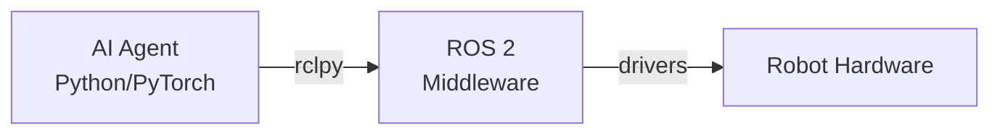

# Python Bridging: Connecting AI Agents with rclpy

:::tip Learning Objective
Learn to use rclpy to create Python-based ROS 2 nodes that bridge AI agents with robot hardware.
:::

## Why Python for Robotics?

Python is the language of AI/ML. **rclpy** lets you:
- Connect TensorFlow/PyTorch models to ROS 2
- Rapid prototyping of robot behaviors
- Integrate with OpenAI APIs for LLM-powered robots



## rclpy Fundamentals

### Creating a Package

```bash
# Create a Python ROS 2 package
cd ~/ros2_ws/src
ros2 pkg create --build-type ament_python my_robot_ai \
    --dependencies rclpy std_msgs sensor_msgs
```

### Package Structure

```
my_robot_ai/
├── my_robot_ai/
│   ├── __init__.py
│   ├── sensor_processor.py
│   └── ai_controller.py
├── resource/
├── test/
├── package.xml
├── setup.py
└── setup.cfg
```

## Building an AI-Connected Node

### Step 1: Sensor Subscriber

```python
#!/usr/bin/env python3
"""
sensor_processor.py
Subscribes to camera data and runs AI inference.
"""

import rclpy
from rclpy.node import Node
from sensor_msgs.msg import Image
from cv_bridge import CvBridge
import numpy as np

class SensorProcessor(Node):
    def __init__(self):
        super().__init__('sensor_processor')
        
        # Subscribe to camera topic
        self.subscription = self.create_subscription(
            Image,
            '/camera/image_raw',
            self.image_callback,
            10
        )
        
        self.bridge = CvBridge()
        self.get_logger().info('Sensor processor ready')
    
    def image_callback(self, msg: Image):
        # Convert ROS Image to OpenCV format
        cv_image = self.bridge.imgmsg_to_cv2(msg, 'bgr8')
        
        # Run AI inference (placeholder)
        detections = self.run_detection(cv_image)
        
        self.get_logger().info(f'Detected {len(detections)} objects')
    
    def run_detection(self, image: np.ndarray) -> list:
        """Placeholder for AI model inference."""
        # In practice: return self.model.predict(image)
        return []

def main(args=None):
    rclpy.init(args=args)
    node = SensorProcessor()
    rclpy.spin(node)
    node.destroy_node()
    rclpy.shutdown()

if __name__ == '__main__':
    main()
```

### Step 2: AI Controller with Publisher

```python
#!/usr/bin/env python3
"""
ai_controller.py
AI agent that publishes control commands.
"""

import rclpy
from rclpy.node import Node
from geometry_msgs.msg import Twist
from std_msgs.msg import String

class AIController(Node):
    def __init__(self):
        super().__init__('ai_controller')
        
        # Publisher for velocity commands
        self.cmd_pub = self.create_publisher(Twist, '/cmd_vel', 10)
        
        # Publisher for status
        self.status_pub = self.create_publisher(String, '/ai_status', 10)
        
        # Subscriber for detected objects
        self.subscription = self.create_subscription(
            String,
            '/detected_objects',
            self.detection_callback,
            10
        )
        
        # Control loop timer (10 Hz)
        self.timer = self.create_timer(0.1, self.control_loop)
        
        self.current_target = None
        self.get_logger().info('AI Controller initialized')
    
    def detection_callback(self, msg: String):
        """Process detections from perception node."""
        self.current_target = msg.data
        self.get_logger().info(f'Target acquired: {self.current_target}')
    
    def control_loop(self):
        """Main AI decision loop."""
        cmd = Twist()
        status = String()
        
        if self.current_target:
            # AI decision: move towards target
            cmd.linear.x = 0.5  # forward
            cmd.angular.z = 0.0  # straight
            status.data = f'Approaching {self.current_target}'
        else:
            # AI decision: search for targets
            cmd.linear.x = 0.0
            cmd.angular.z = 0.3  # rotate to search
            status.data = 'Searching...'
        
        self.cmd_pub.publish(cmd)
        self.status_pub.publish(status)

def main(args=None):
    rclpy.init(args=args)
    node = AIController()
    rclpy.spin(node)
    node.destroy_node()
    rclpy.shutdown()
```

## Connecting to External AI Services

### OpenAI Integration Example

```python
from openai import OpenAI

class LLMRobotController(Node):
    def __init__(self):
        super().__init__('llm_controller')
        self.client = OpenAI()
        
        self.command_sub = self.create_subscription(
            String, '/voice_command', self.process_command, 10
        )
    
    def process_command(self, msg: String):
        """Use LLM to interpret natural language command."""
        response = self.client.chat.completions.create(
            model="gpt-4",
            messages=[
                {"role": "system", "content": "Convert to ROS 2 action."},
                {"role": "user", "content": msg.data}
            ]
        )
        
        action = response.choices[0].message.content
        self.execute_ros_action(action)
```

:::danger API Keys
Never hardcode API keys in source code. Use environment variables:
```python
import os
api_key = os.environ.get('OPENAI_API_KEY')
```
:::

## Launch Files

Orchestrate multiple nodes:

```python
# launch/ai_system.launch.py
from launch import LaunchDescription
from launch_ros.actions import Node

def generate_launch_description():
    return LaunchDescription([
        Node(
            package='my_robot_ai',
            executable='sensor_processor',
            name='sensor_processor'
        ),
        Node(
            package='my_robot_ai',
            executable='ai_controller',
            name='ai_controller'
        ),
    ])
```

```bash
ros2 launch my_robot_ai ai_system.launch.py
```

## Best Practices

| Practice | Reason |
|----------|--------|
| Use **async** for AI inference | Prevent blocking the ROS callback |
| **QoS profiles** for sensors | Handle message drops gracefully |
| **Parameter server** for config | Runtime tuning without rebuild |
| **Lifecycle nodes** | Clean startup/shutdown |

---

**Next**: [URDF and Humanoid Anatomy →](./03-urdf-humanoid)
