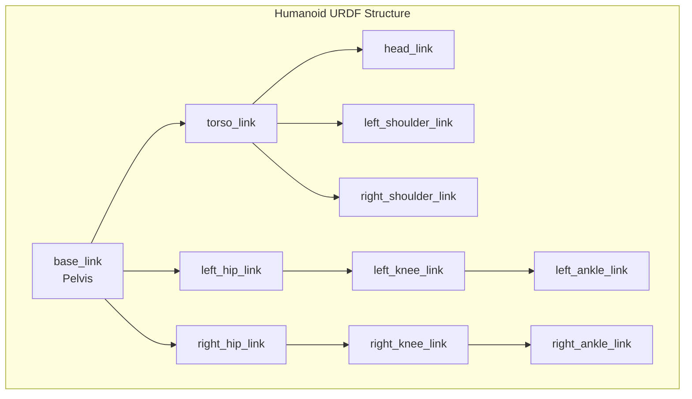

# URDF: Defining Humanoid Robot Anatomy

:::tip Learning Objective
Master URDF (Unified Robot Description Format) to define robot structure, joints, and kinematics.
:::

## What is URDF?

**URDF** is an XML format that describes a robot's:
- **Links**: Physical body parts (torso, arms, legs)
- **Joints**: Connections between links
- **Visuals**: How the robot appears
- **Collisions**: Simplified geometry for physics
- **Inertials**: Mass and center of gravity



## URDF Structure

### Basic Link Definition

```xml
<?xml version="1.0"?>
<robot name="simple_humanoid">
  
  <!-- Base Link (Pelvis) -->
  <link name="base_link">
    <visual>
      <geometry>
        <box size="0.3 0.2 0.15"/>
      </geometry>
      <material name="blue">
        <color rgba="0.0 0.0 0.8 1.0"/>
      </material>
    </visual>
    
    <collision>
      <geometry>
        <box size="0.3 0.2 0.15"/>
      </geometry>
    </collision>
    
    <inertial>
      <mass value="5.0"/>
      <inertia ixx="0.1" ixy="0" ixz="0" 
               iyy="0.1" iyz="0" izz="0.1"/>
    </inertial>
  </link>

</robot>
```

### Joint Types

| Joint Type | DOF | Use Case |
|------------|-----|----------|
| `revolute` | 1 | Elbows, knees (limited rotation) |
| `continuous` | 1 | Wheels (unlimited rotation) |
| `prismatic` | 1 | Linear actuators |
| `fixed` | 0 | Rigid connections |
| `floating` | 6 | Free-floating base |

```xml
<!-- Hip Joint (Revolute) -->
<joint name="left_hip_pitch" type="revolute">
  <parent link="base_link"/>
  <child link="left_thigh_link"/>
  <origin xyz="0.1 0.1 0" rpy="0 0 0"/>
  <axis xyz="0 1 0"/>  <!-- Rotation around Y axis -->
  <limit lower="-1.57" upper="1.57" 
         effort="100" velocity="2.0"/>
</joint>
```

## Complete Bipedal Leg URDF

```xml
<?xml version="1.0"?>
<robot name="bipedal_legs">

  <!-- ============ PELVIS ============ -->
  <link name="base_link">
    <visual>
      <geometry><box size="0.3 0.25 0.12"/></geometry>
      <material name="gray"><color rgba="0.5 0.5 0.5 1"/></material>
    </visual>
    <collision><geometry><box size="0.3 0.25 0.12"/></geometry></collision>
    <inertial>
      <mass value="8.0"/>
      <inertia ixx="0.05" ixy="0" ixz="0" iyy="0.08" iyz="0" izz="0.05"/>
    </inertial>
  </link>

  <!-- ============ LEFT LEG ============ -->
  
  <!-- Left Thigh -->
  <link name="left_thigh_link">
    <visual>
      <origin xyz="0 0 -0.2"/>
      <geometry><cylinder radius="0.05" length="0.4"/></geometry>
      <material name="blue"><color rgba="0.2 0.2 0.8 1"/></material>
    </visual>
    <collision>
      <origin xyz="0 0 -0.2"/>
      <geometry><cylinder radius="0.05" length="0.4"/></geometry>
    </collision>
    <inertial>
      <mass value="3.0"/>
      <origin xyz="0 0 -0.2"/>
      <inertia ixx="0.04" ixy="0" ixz="0" iyy="0.04" iyz="0" izz="0.01"/>
    </inertial>
  </link>

  <joint name="left_hip_pitch" type="revolute">
    <parent link="base_link"/>
    <child link="left_thigh_link"/>
    <origin xyz="0 0.1 0" rpy="0 0 0"/>
    <axis xyz="0 1 0"/>
    <limit lower="-1.8" upper="0.5" effort="150" velocity="5.0"/>
  </joint>

  <!-- Left Shin -->
  <link name="left_shin_link">
    <visual>
      <origin xyz="0 0 -0.2"/>
      <geometry><cylinder radius="0.04" length="0.4"/></geometry>
      <material name="blue"><color rgba="0.2 0.2 0.8 1"/></material>
    </visual>
    <collision>
      <origin xyz="0 0 -0.2"/>
      <geometry><cylinder radius="0.04" length="0.4"/></geometry>
    </collision>
    <inertial>
      <mass value="2.0"/>
      <origin xyz="0 0 -0.2"/>
      <inertia ixx="0.03" ixy="0" ixz="0" iyy="0.03" iyz="0" izz="0.005"/>
    </inertial>
  </link>

  <joint name="left_knee" type="revolute">
    <parent link="left_thigh_link"/>
    <child link="left_shin_link"/>
    <origin xyz="0 0 -0.4" rpy="0 0 0"/>
    <axis xyz="0 1 0"/>
    <limit lower="0" upper="2.5" effort="120" velocity="6.0"/>
  </joint>

  <!-- Left Foot -->
  <link name="left_foot_link">
    <visual>
      <geometry><box size="0.2 0.08 0.03"/></geometry>
      <material name="dark"><color rgba="0.2 0.2 0.2 1"/></material>
    </visual>
    <collision><geometry><box size="0.2 0.08 0.03"/></geometry></collision>
    <inertial>
      <mass value="0.5"/>
      <inertia ixx="0.001" ixy="0" ixz="0" iyy="0.002" iyz="0" izz="0.001"/>
    </inertial>
  </link>

  <joint name="left_ankle" type="revolute">
    <parent link="left_shin_link"/>
    <child link="left_foot_link"/>
    <origin xyz="0 0 -0.4" rpy="0 0 0"/>
    <axis xyz="0 1 0"/>
    <limit lower="-0.8" upper="0.8" effort="80" velocity="4.0"/>
  </joint>

  <!-- Mirror for RIGHT LEG (similar structure) -->
  <!-- ... -->

</robot>
```

## Visualizing URDF

```bash
# Install URDF tools
sudo apt install ros-humble-urdf-tutorial

# View in RViz
ros2 launch urdf_tutorial display.launch.py model:=my_robot.urdf
```

:::danger Joint Limits
Always set realistic joint limits! Exceeding physical limits can damage hardware:
```xml
<limit lower="-1.57" upper="1.57"   <!-- ±90 degrees -->
       effort="100"                   <!-- Max torque (Nm) -->
       velocity="2.0"/>               <!-- Max speed (rad/s) -->
```
:::

## URDF Best Practices

| Practice | Reason |
|----------|--------|
| Use **xacro** for complex robots | Macros reduce repetition |
| Define **collision** geometry | Simpler than visual for physics |
| Accurate **inertials** | Critical for dynamics simulation |
| Consistent **naming** convention | `{side}_{joint}_link` pattern |

---

**Next**: [Hello Robot Deliverable →](./04-hello-robot)
