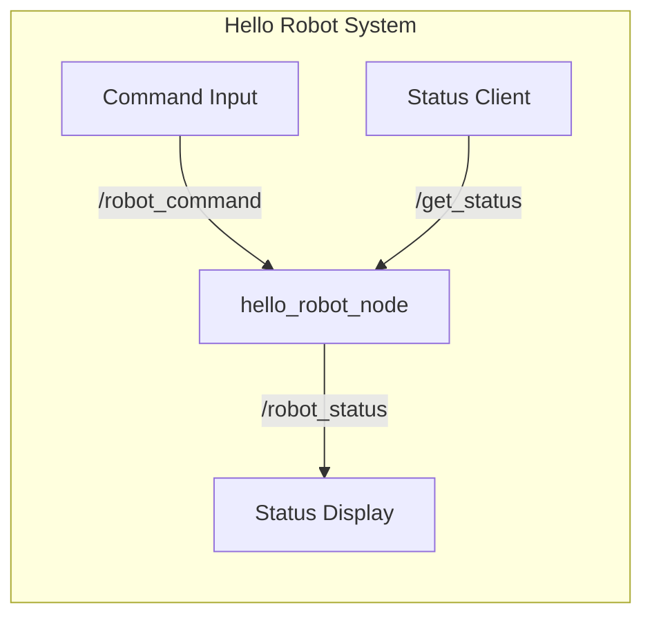

# Deliverable: Hello Robot Node

:::tip Learning Objective
Build a complete, functional ROS 2 node that demonstrates core concepts from Module 01.
:::

## Project Overview

Create a **"Hello Robot"** ROS 2 package that:
1. ✅ Publishes robot status messages
2. ✅ Subscribes to command inputs
3. ✅ Provides a service for status queries
4. ✅ Visualizes a basic URDF in RViz



## Step 1: Create the Package

```bash
cd ~/ros2_ws/src

ros2 pkg create --build-type ament_python hello_robot \
    --dependencies rclpy std_msgs std_srvs
```

## Step 2: The Main Node

Create `hello_robot/hello_robot_node.py`:

```python
#!/usr/bin/env python3
"""
Hello Robot Node
================
A complete ROS 2 node demonstrating:
- Publishing (robot status)
- Subscribing (commands)
- Services (status query)
"""

import rclpy
from rclpy.node import Node
from std_msgs.msg import String
from std_srvs.srv import Trigger

class HelloRobotNode(Node):
    """Main robot controller node."""
    
    def __init__(self):
        super().__init__('hello_robot')
        
        # === PARAMETERS ===
        self.declare_parameter('robot_name', 'Atlas')
        self.robot_name = self.get_parameter('robot_name').value
        
        # === STATE ===
        self.is_active = True
        self.command_count = 0
        
        # === PUBLISHER: Robot Status ===
        self.status_pub = self.create_publisher(
            String, 
            'robot_status', 
            10
        )
        
        # === SUBSCRIBER: Commands ===
        self.command_sub = self.create_subscription(
            String,
            'robot_command',
            self.command_callback,
            10
        )
        
        # === SERVICE: Get Status ===
        self.status_srv = self.create_service(
            Trigger,
            'get_status',
            self.status_service_callback
        )
        
        # === TIMER: Periodic Status ===
        self.timer = self.create_timer(1.0, self.publish_status)
        
        self.get_logger().info(f'🤖 {self.robot_name} is online!')
    
    def publish_status(self):
        """Publish robot status every second."""
        msg = String()
        status = "ACTIVE" if self.is_active else "STANDBY"
        msg.data = f'[{self.robot_name}] Status: {status} | Commands: {self.command_count}'
        self.status_pub.publish(msg)
    
    def command_callback(self, msg: String):
        """Handle incoming commands."""
        self.command_count += 1
        command = msg.data.lower()
        
        self.get_logger().info(f'📨 Received command: {command}')
        
        if command == 'activate':
            self.is_active = True
            self.get_logger().info('✅ Robot ACTIVATED')
        elif command == 'standby':
            self.is_active = False
            self.get_logger().info('💤 Robot in STANDBY')
        elif command == 'wave':
            self.get_logger().info('👋 *waves enthusiastically*')
        elif command == 'dance':
            self.get_logger().info('💃 *does robot dance*')
        else:
            self.get_logger().warn(f'❓ Unknown command: {command}')
    
    def status_service_callback(self, request, response):
        """Handle status service requests."""
        response.success = self.is_active
        response.message = (
            f'{self.robot_name}: '
            f'{"Active" if self.is_active else "Standby"}, '
            f'{self.command_count} commands processed'
        )
        return response


def main(args=None):
    rclpy.init(args=args)
    
    node = HelloRobotNode()
    
    try:
        rclpy.spin(node)
    except KeyboardInterrupt:
        node.get_logger().info('Shutting down...')
    finally:
        node.destroy_node()
        rclpy.shutdown()


if __name__ == '__main__':
    main()
```

## Step 3: Setup Configuration

Update `setup.py`:

```python
from setuptools import find_packages, setup

package_name = 'hello_robot'

setup(
    name=package_name,
    version='1.0.0',
    packages=find_packages(exclude=['test']),
    data_files=[
        ('share/ament_index/resource_index/packages',
            ['resource/' + package_name]),
        ('share/' + package_name, ['package.xml']),
        ('share/' + package_name + '/launch', ['launch/hello_robot.launch.py']),
        ('share/' + package_name + '/urdf', ['urdf/simple_robot.urdf']),
    ],
    install_requires=['setuptools'],
    zip_safe=True,
    maintainer='your_name',
    maintainer_email='your@email.com',
    description='Hello Robot - ROS 2 Introduction Package',
    license='MIT',
    entry_points={
        'console_scripts': [
            'hello_robot_node = hello_robot.hello_robot_node:main',
        ],
    },
)
```

## Step 4: Launch File

Create `launch/hello_robot.launch.py`:

```python
from launch import LaunchDescription
from launch_ros.actions import Node
from launch.actions import DeclareLaunchArgument
from launch.substitutions import LaunchConfiguration

def generate_launch_description():
    return LaunchDescription([
        DeclareLaunchArgument(
            'robot_name',
            default_value='Atlas',
            description='Name of the robot'
        ),
        
        Node(
            package='hello_robot',
            executable='hello_robot_node',
            name='hello_robot',
            parameters=[{
                'robot_name': LaunchConfiguration('robot_name')
            }],
            output='screen'
        ),
    ])
```

## Step 5: Build and Run

```bash
# Build
cd ~/ros2_ws
colcon build --packages-select hello_robot
source install/setup.bash

# Run the node
ros2 launch hello_robot hello_robot.launch.py robot_name:=Optimus
```

## Step 6: Interact with the Robot

Open new terminals:

```bash
# Terminal 2: Listen to status
ros2 topic echo /robot_status

# Terminal 3: Send commands
ros2 topic pub /robot_command std_msgs/msg/String "data: 'wave'"
ros2 topic pub /robot_command std_msgs/msg/String "data: 'dance'"
ros2 topic pub /robot_command std_msgs/msg/String "data: 'standby'"

# Terminal 4: Call service
ros2 service call /get_status std_srvs/srv/Trigger
```

## Expected Output

```
[INFO] [hello_robot]: 🤖 Optimus is online!
[INFO] [hello_robot]: 📨 Received command: wave
[INFO] [hello_robot]: 👋 *waves enthusiastically*
[INFO] [hello_robot]: 📨 Received command: dance
[INFO] [hello_robot]: 💃 *does robot dance*
```

:::tip Checkpoint
If your node runs and responds to commands, you've completed Module 01! 🎉
:::

---

**Module Complete!** 

**Next Module**: [The Digital Twin (Gazebo & Unity) →](../02-digital-twin)
