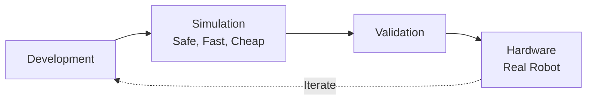
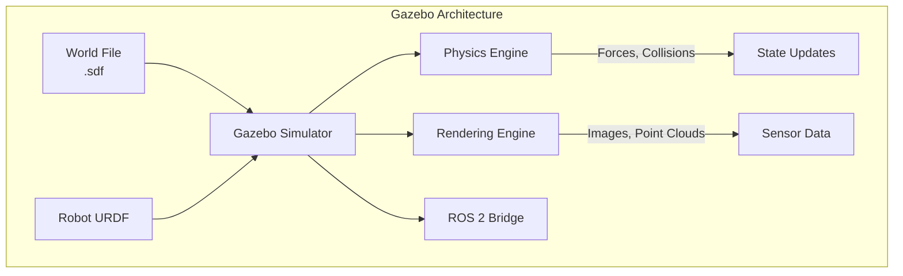

# Physics Engines: Simulating Reality with Gazebo

:::tip Learning Objective
Configure physics simulation in Gazebo for realistic robot behavior including gravity, friction, and collision.
:::

## Why Simulation Matters

Before deploying on real hardware, we **must** test in simulation:



| Testing | Simulation | Real Hardware |
|---------|------------|---------------|
| **Cost per crash** | Free | $1000s |
| **Iteration speed** | Minutes | Days |
| **Safety risk** | None | High |
| **Physics accuracy** | ~90% | 100% |

## Gazebo Overview

**Gazebo** (now "Gazebo Sim" / "Ignition") is the standard ROS 2 simulator:



## Setting Up Gazebo

### Installation

```bash
# Install Gazebo Harmonic (latest) with ROS 2 Humble
sudo apt install ros-humble-ros-gz

# Verify installation
gz sim --version
```

### Basic World File

Create `worlds/empty_room.sdf`:

```xml
<?xml version="1.0" ?>
<sdf version="1.8">
  <world name="empty_room">
    
    <!-- Physics Configuration -->
    <physics name="1ms" type="dart">
      <max_step_size>0.001</max_step_size>
      <real_time_factor>1.0</real_time_factor>
    </physics>
    
    <!-- Gravity -->
    <gravity>0 0 -9.81</gravity>
    
    <!-- Lighting -->
    <light type="directional" name="sun">
      <cast_shadows>true</cast_shadows>
      <pose>0 0 10 0 0 0</pose>
      <diffuse>0.8 0.8 0.8 1</diffuse>
      <specular>0.2 0.2 0.2 1</specular>
      <direction>-0.5 0.1 -0.9</direction>
    </light>
    
    <!-- Ground Plane -->
    <model name="ground_plane">
      <static>true</static>
      <link name="link">
        <collision name="collision">
          <geometry>
            <plane>
              <normal>0 0 1</normal>
              <size>100 100</size>
            </plane>
          </geometry>
          <surface>
            <friction>
              <ode>
                <mu>0.8</mu>
                <mu2>0.8</mu2>
              </ode>
            </friction>
          </surface>
        </collision>
        <visual name="visual">
          <geometry>
            <plane>
              <normal>0 0 1</normal>
              <size>100 100</size>
            </plane>
          </geometry>
          <material>
            <ambient>0.8 0.8 0.8 1</ambient>
            <diffuse>0.8 0.8 0.8 1</diffuse>
          </material>
        </visual>
      </link>
    </model>
    
    <!-- Walls -->
    <include>
      <uri>model://wall_segment</uri>
      <pose>5 0 1 0 0 0</pose>
    </include>
    
  </world>
</sdf>
```

## Physics Configuration

### Gravity

```xml
<!-- Earth gravity -->
<gravity>0 0 -9.81</gravity>

<!-- Moon gravity (for testing) -->
<gravity>0 0 -1.62</gravity>

<!-- Zero-G -->
<gravity>0 0 0</gravity>
```

### Friction

```xml
<surface>
  <friction>
    <ode>
      <mu>0.8</mu>      <!-- Primary friction coefficient -->
      <mu2>0.8</mu2>    <!-- Secondary friction coefficient -->
      <slip1>0.0</slip1>
      <slip2>0.0</slip2>
    </ode>
  </friction>
</surface>
```

| Surface | μ (mu) Value |
|---------|--------------|
| Ice | 0.03 |
| Wood | 0.4 |
| Rubber on concrete | 0.8 |
| Rubber on rubber | 1.2 |

### Collision Detection

```xml
<collision name="body_collision">
  <geometry>
    <box><size>0.5 0.5 0.5</size></box>
  </geometry>
  
  <surface>
    <contact>
      <collide_bitmask>0x01</collide_bitmask>
    </contact>
    <bounce>
      <restitution_coefficient>0.3</restitution_coefficient>
      <threshold>0.5</threshold>
    </bounce>
  </surface>
</collision>
```

:::danger Collision Meshes
Use **simplified** collision geometry! Complex meshes slow simulation:
```xml
<!-- SLOW: Using visual mesh for collision -->
<collision><geometry><mesh><uri>detailed_model.dae</uri></mesh></geometry></collision>

<!-- FAST: Simplified collision box -->
<collision><geometry><box><size>1 1 1</size></box></geometry></collision>
```
:::

## ROS 2 Integration

### Spawning Robot

```python
# spawn_robot.launch.py
from launch import LaunchDescription
from launch_ros.actions import Node
from launch.actions import IncludeLaunchDescription
from launch.launch_description_sources import PythonLaunchDescriptionSource
import os

def generate_launch_description():
    pkg_ros_gz_sim = get_package_share_directory('ros_gz_sim')
    
    return LaunchDescription([
        # Start Gazebo
        IncludeLaunchDescription(
            PythonLaunchDescriptionSource(
                os.path.join(pkg_ros_gz_sim, 'launch', 'gz_sim.launch.py')
            ),
            launch_arguments={'gz_args': 'empty_room.sdf'}.items()
        ),
        
        # Spawn robot
        Node(
            package='ros_gz_sim',
            executable='create',
            arguments=[
                '-name', 'my_robot',
                '-file', 'robot.urdf',
                '-x', '0', '-y', '0', '-z', '0.5'
            ]
        ),
        
        # Bridge ROS 2 <-> Gazebo
        Node(
            package='ros_gz_bridge',
            executable='parameter_bridge',
            arguments=[
                '/cmd_vel@geometry_msgs/msg/Twist@gz.msgs.Twist',
                '/odom@nav_msgs/msg/Odometry@gz.msgs.Odometry',
            ]
        ),
    ])
```

## Step Time and Real-Time Factor

```xml
<physics name="physics_config" type="dart">
  <!-- Simulation step size (smaller = more accurate, slower) -->
  <max_step_size>0.001</max_step_size>  <!-- 1ms = 1000 Hz -->
  
  <!-- Real-time factor (1.0 = real-time, 2.0 = 2x speed) -->
  <real_time_factor>1.0</real_time_factor>
  
  <!-- Update rate for visuals -->
  <real_time_update_rate>1000</real_time_update_rate>
</physics>
```

---

**Next**: [Unity for Human-Robot Interaction →](./02-unity-rendering)
