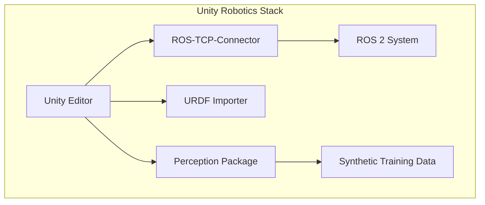
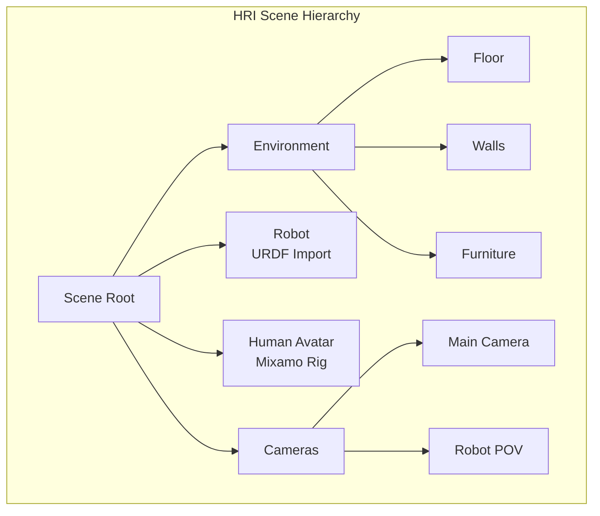

# Unity for Human-Robot Interaction Scenarios

:::tip Learning Objective
Set up Unity for high-fidelity rendering and human-robot interaction simulations.
:::

## Why Unity for Robotics?

While Gazebo excels at physics, **Unity** provides:

| Feature | Gazebo | Unity |
|---------|--------|-------|
| Physics accuracy | ⭐⭐⭐⭐ | ⭐⭐⭐ |
| Visual quality | ⭐⭐ | ⭐⭐⭐⭐⭐ |
| Human avatars | ❌ | ✅ |
| VR/AR support | ❌ | ✅ |
| Synthetic data | Basic | Advanced |



## Setting Up Unity for Robotics

### 1. Install Unity Robotics Packages

```
# In Unity Package Manager, add by git URL:
https://github.com/Unity-Technologies/ROS-TCP-Connector.git?path=/com.unity.robotics.ros-tcp-connector
https://github.com/Unity-Technologies/URDF-Importer.git?path=/com.unity.robotics.urdf-importer
https://github.com/Unity-Technologies/com.unity.perception.git
```

### 2. Import Robot URDF

```csharp
// Unity C# - Import URDF programmatically
using Unity.Robotics.UrdfImporter;

public class RobotLoader : MonoBehaviour
{
    public string urdfPath = "Assets/Robots/humanoid.urdf";
    
    void Start()
    {
        ImportSettings settings = new ImportSettings
        {
            chooserType = ImportSettings.ConvenienceType.ArticulationBody,
            physicsSettingsType = ImportSettings.PhysicsType.ArticulationBody
        };
        
        UrdfRobotExtensions.Create(urdfPath, settings);
    }
}
```

### 3. ROS 2 Connection

```csharp
// ROS2Connection.cs
using Unity.Robotics.ROSTCPConnector;
using RosMessageTypes.Geometry;

public class RobotController : MonoBehaviour
{
    private ROSConnection ros;
    
    void Start()
    {
        ros = ROSConnection.GetOrCreateInstance();
        ros.RegisterPublisher<TwistMsg>("/cmd_vel");
        ros.Subscribe<TwistMsg>("/robot_feedback", FeedbackCallback);
    }
    
    void Update()
    {
        // Publish velocity command based on input
        TwistMsg msg = new TwistMsg();
        msg.linear.x = Input.GetAxis("Vertical");
        msg.angular.z = Input.GetAxis("Horizontal");
        ros.Publish("/cmd_vel", msg);
    }
    
    void FeedbackCallback(TwistMsg msg)
    {
        Debug.Log($"Robot velocity: {msg.linear.x}");
    }
}
```

## Creating HRI Scenarios

### Human Avatar Setup

```csharp
// HumanInteraction.cs
using UnityEngine;

public class HumanInteraction : MonoBehaviour
{
    public Animator humanAnimator;
    public Transform robotTarget;
    
    private enum InteractionState { Idle, Approaching, Interacting }
    private InteractionState state = InteractionState.Idle;
    
    void Update()
    {
        float distance = Vector3.Distance(
            transform.position, 
            robotTarget.position
        );
        
        switch (state)
        {
            case InteractionState.Idle:
                if (distance < 3.0f)
                {
                    state = InteractionState.Approaching;
                    humanAnimator.SetTrigger("Wave");
                }
                break;
                
            case InteractionState.Approaching:
                // Move towards robot
                transform.position = Vector3.MoveTowards(
                    transform.position,
                    robotTarget.position,
                    Time.deltaTime * 1.0f
                );
                
                if (distance < 1.0f)
                {
                    state = InteractionState.Interacting;
                    humanAnimator.SetTrigger("Talk");
                }
                break;
                
            case InteractionState.Interacting:
                // Face the robot
                transform.LookAt(robotTarget);
                break;
        }
    }
}
```

### Scene Configuration



## Synthetic Data Generation

Unity Perception package generates training data:

```csharp
// DataGenerator.cs
using UnityEngine.Perception.Randomization.Randomizers;

public class RobotDataRandomizer : Randomizer
{
    public FloatParameter robotXPosition;
    public FloatParameter lightIntensity;
    
    protected override void OnIterationStart()
    {
        // Randomize robot position
        var robot = GameObject.Find("Robot");
        var pos = robot.transform.position;
        pos.x = robotXPosition.Sample();
        robot.transform.position = pos;
        
        // Randomize lighting
        var light = GameObject.Find("Directional Light");
        light.GetComponent<Light>().intensity = lightIntensity.Sample();
    }
}
```

:::tip Pro Tip
Use Unity's **Perception** package to generate labeled datasets for training computer vision models. This enables "sim-to-real" transfer for perception tasks.
:::

## Build Settings for Robotics

```
Project Settings → Physics:
- Fixed Timestep: 0.005 (200 Hz)
- Solver Iterations: 10
- Solver Velocity Iterations: 10

Project Settings → Quality:
- VSync: Off (for real-time simulation)
- Target Frame Rate: 60
```

---

**Next**: [Sensor Simulation →](./03-sensor-simulation)
