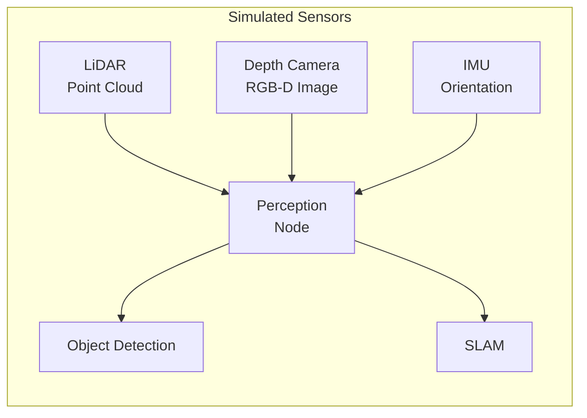

# Sensor Simulation: LiDAR, Cameras, and IMU

:::tip Learning Objective
Implement simulated sensors that produce realistic data streams for perception algorithms.
:::

## Why Simulate Sensors?

Real sensors are expensive and require physical setup. Simulation lets you:
- Test perception algorithms without hardware
- Generate unlimited training data
- Create edge cases that are rare in real life



## LiDAR Simulation

### Gazebo LiDAR Plugin

```xml
<!-- Add to robot URDF/SDF -->
<sensor name="lidar" type="gpu_lidar">
  <pose>0 0 0.5 0 0 0</pose>
  <topic>/scan</topic>
  <update_rate>10</update_rate>
  
  <lidar>
    <scan>
      <horizontal>
        <samples>640</samples>
        <resolution>1</resolution>
        <min_angle>-3.14159</min_angle>
        <max_angle>3.14159</max_angle>
      </horizontal>
      <vertical>
        <samples>16</samples>
        <resolution>1</resolution>
        <min_angle>-0.26</min_angle>
        <max_angle>0.26</max_angle>
      </vertical>
    </scan>
    <range>
      <min>0.1</min>
      <max>100.0</max>
      <resolution>0.01</resolution>
    </range>
    <noise>
      <type>gaussian</type>
      <mean>0.0</mean>
      <stddev>0.01</stddev>
    </noise>
  </lidar>
  
  <visualize>true</visualize>
</sensor>
```

### Processing LiDAR in ROS 2

```python
from sensor_msgs.msg import LaserScan, PointCloud2
import numpy as np

class LidarProcessor(Node):
    def __init__(self):
        super().__init__('lidar_processor')
        
        self.subscription = self.create_subscription(
            LaserScan,
            '/scan',
            self.scan_callback,
            10
        )
    
    def scan_callback(self, msg: LaserScan):
        # Convert to numpy array
        ranges = np.array(msg.ranges)
        
        # Filter invalid readings
        valid = (ranges > msg.range_min) & (ranges < msg.range_max)
        
        # Find closest obstacle
        min_distance = np.min(ranges[valid])
        min_angle = msg.angle_min + np.argmin(ranges[valid]) * msg.angle_increment
        
        self.get_logger().info(
            f'Closest obstacle: {min_distance:.2f}m at {np.degrees(min_angle):.1f}°'
        )
```

## Depth Camera Simulation

### Gazebo RGB-D Camera

```xml
<sensor name="rgbd_camera" type="rgbd_camera">
  <pose>0 0 0.5 0 0 0</pose>
  <camera>
    <horizontal_fov>1.047</horizontal_fov>
    <image>
      <width>640</width>
      <height>480</height>
      <format>R8G8B8</format>
    </image>
    <clip>
      <near>0.1</near>
      <far>10</far>
    </clip>
    <depth_camera>
      <clip>
        <near>0.1</near>
        <far>10</far>
      </clip>
    </depth_camera>
    <noise>
      <type>gaussian</type>
      <mean>0</mean>
      <stddev>0.007</stddev>
    </noise>
  </camera>
  <update_rate>30</update_rate>
  <topic>/camera</topic>
</sensor>
```

### Processing Depth Images

```python
from sensor_msgs.msg import Image
from cv_bridge import CvBridge
import cv2
import numpy as np

class DepthProcessor(Node):
    def __init__(self):
        super().__init__('depth_processor')
        self.bridge = CvBridge()
        
        self.rgb_sub = self.create_subscription(
            Image, '/camera/color/image_raw', self.rgb_callback, 10
        )
        self.depth_sub = self.create_subscription(
            Image, '/camera/depth/image_raw', self.depth_callback, 10
        )
        
        self.latest_rgb = None
        self.latest_depth = None
    
    def rgb_callback(self, msg):
        self.latest_rgb = self.bridge.imgmsg_to_cv2(msg, 'bgr8')
    
    def depth_callback(self, msg):
        # Depth is typically 16UC1 (millimeters) or 32FC1 (meters)
        self.latest_depth = self.bridge.imgmsg_to_cv2(msg, '32FC1')
        
        if self.latest_rgb is not None:
            self.process_rgbd()
    
    def process_rgbd(self):
        # Example: Find objects within 1 meter
        close_mask = self.latest_depth < 1.0
        
        # Apply to RGB image
        highlighted = self.latest_rgb.copy()
        highlighted[close_mask] = [0, 0, 255]  # Red highlight
        
        cv2.imshow('Close Objects', highlighted)
        cv2.waitKey(1)
```

## IMU Simulation

### Gazebo IMU Plugin

```xml
<sensor name="imu" type="imu">
  <pose>0 0 0.3 0 0 0</pose>
  <update_rate>200</update_rate>
  <topic>/imu</topic>
  
  <imu>
    <angular_velocity>
      <x>
        <noise type="gaussian">
          <mean>0</mean>
          <stddev>0.0001</stddev>
        </noise>
      </x>
      <y><noise type="gaussian"><mean>0</mean><stddev>0.0001</stddev></noise></y>
      <z><noise type="gaussian"><mean>0</mean><stddev>0.0001</stddev></noise></z>
    </angular_velocity>
    
    <linear_acceleration>
      <x><noise type="gaussian"><mean>0</mean><stddev>0.01</stddev></noise></x>
      <y><noise type="gaussian"><mean>0</mean><stddev>0.01</stddev></noise></y>
      <z><noise type="gaussian"><mean>0</mean><stddev>0.01</stddev></noise></z>
    </linear_acceleration>
  </imu>
</sensor>
```

### IMU Data Processing

```python
from sensor_msgs.msg import Imu
import tf_transformations

class IMUProcessor(Node):
    def __init__(self):
        super().__init__('imu_processor')
        
        self.subscription = self.create_subscription(
            Imu, '/imu', self.imu_callback, 10
        )
    
    def imu_callback(self, msg: Imu):
        # Extract orientation (quaternion)
        q = [
            msg.orientation.x,
            msg.orientation.y,
            msg.orientation.z,
            msg.orientation.w
        ]
        
        # Convert to Euler angles (roll, pitch, yaw)
        euler = tf_transformations.euler_from_quaternion(q)
        roll, pitch, yaw = np.degrees(euler)
        
        self.get_logger().info(
            f'Orientation - Roll: {roll:.1f}° Pitch: {pitch:.1f}° Yaw: {yaw:.1f}°'
        )
        
        # Extract angular velocity
        ang_vel = msg.angular_velocity
        self.get_logger().debug(
            f'Angular velocity: [{ang_vel.x:.2f}, {ang_vel.y:.2f}, {ang_vel.z:.2f}]'
        )
```

## Sensor Noise Models

:::danger Realistic Noise
Always add **realistic noise** to simulated sensors! Perfect sensors create models that fail in the real world.
:::

| Sensor | Noise Type | Typical Values |
|--------|-----------|----------------|
| LiDAR | Gaussian | σ = 0.01-0.02m |
| Camera | Gaussian | σ = 0.007 |
| IMU Gyro | Gaussian + Bias | σ = 0.0001 rad/s |
| IMU Accel | Gaussian + Bias | σ = 0.01 m/s² |

---

**Next**: [Obstacle Sensing Deliverable →](./04-obstacle-sensing)
