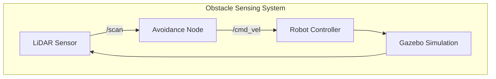
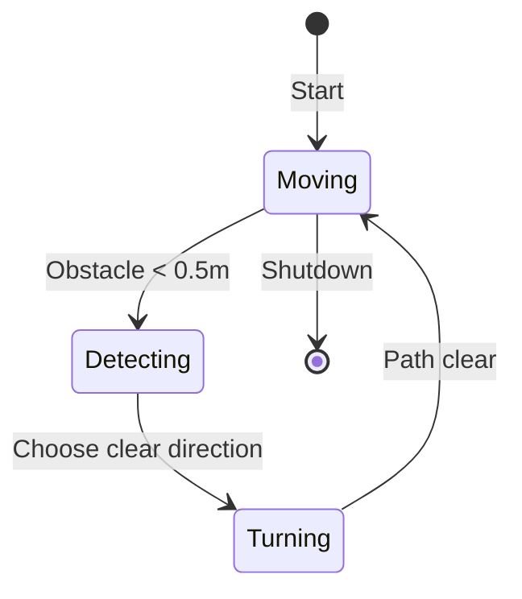

# Deliverable: Obstacle-Sensing Simulation

:::tip Learning Objective
Build a complete simulation environment where a robot uses sensors to detect walls and obstacles.
:::

## Project Overview

Create a simulation where:
1. ✅ Robot spawns in a room with walls
2. ✅ LiDAR detects obstacles
3. ✅ Robot visualizes sensor data
4. ✅ Simple avoidance behavior



## Step 1: World File with Obstacles

Create `worlds/obstacle_room.sdf`:

```xml
<?xml version="1.0" ?>
<sdf version="1.8">
  <world name="obstacle_room">
    
    <physics name="1ms" type="dart">
      <max_step_size>0.001</max_step_size>
      <real_time_factor>1.0</real_time_factor>
    </physics>
    
    <gravity>0 0 -9.81</gravity>
    
    <light type="directional" name="sun">
      <pose>0 0 10 0 0 0</pose>
      <diffuse>0.8 0.8 0.8 1</diffuse>
    </light>
    
    <!-- Ground -->
    <model name="ground">
      <static>true</static>
      <link name="link">
        <collision name="collision">
          <geometry><plane><normal>0 0 1</normal><size>20 20</size></plane></geometry>
        </collision>
        <visual name="visual">
          <geometry><plane><normal>0 0 1</normal><size>20 20</size></plane></geometry>
          <material><ambient>0.3 0.3 0.3 1</ambient></material>
        </visual>
      </link>
    </model>
    
    <!-- Walls -->
    <model name="wall_north">
      <static>true</static>
      <pose>0 5 1 0 0 0</pose>
      <link name="link">
        <collision name="collision">
          <geometry><box><size>10 0.2 2</size></box></geometry>
        </collision>
        <visual name="visual">
          <geometry><box><size>10 0.2 2</size></box></geometry>
          <material><ambient>0.7 0.7 0.7 1</ambient></material>
        </visual>
      </link>
    </model>
    
    <model name="wall_south">
      <static>true</static>
      <pose>0 -5 1 0 0 0</pose>
      <link name="link">
        <collision name="collision">
          <geometry><box><size>10 0.2 2</size></box></geometry>
        </collision>
        <visual name="visual">
          <geometry><box><size>10 0.2 2</size></box></geometry>
          <material><ambient>0.7 0.7 0.7 1</ambient></material>
        </visual>
      </link>
    </model>
    
    <!-- Obstacles -->
    <model name="obstacle_1">
      <static>true</static>
      <pose>2 2 0.5 0 0 0</pose>
      <link name="link">
        <collision name="collision">
          <geometry><cylinder><radius>0.5</radius><length>1</length></cylinder></geometry>
        </collision>
        <visual name="visual">
          <geometry><cylinder><radius>0.5</radius><length>1</length></cylinder></geometry>
          <material><ambient>0.8 0.2 0.2 1</ambient></material>
        </visual>
      </link>
    </model>
    
    <model name="obstacle_2">
      <static>true</static>
      <pose>-2 -1 0.5 0 0 0</pose>
      <link name="link">
        <collision name="collision">
          <geometry><box><size>1 1 1</size></box></geometry>
        </collision>
        <visual name="visual">
          <geometry><box><size>1 1 1</size></box></geometry>
          <material><ambient>0.2 0.8 0.2 1</ambient></material>
        </visual>
      </link>
    </model>
    
  </world>
</sdf>
```

## Step 2: Obstacle Avoidance Node

Create `obstacle_avoider.py`:

```python
#!/usr/bin/env python3
"""
Obstacle Avoider Node
=====================
Simple reactive obstacle avoidance using LiDAR.
"""

import rclpy
from rclpy.node import Node
from sensor_msgs.msg import LaserScan
from geometry_msgs.msg import Twist
import numpy as np

class ObstacleAvoider(Node):
    def __init__(self):
        super().__init__('obstacle_avoider')
        
        # Parameters
        self.declare_parameter('safe_distance', 0.5)
        self.declare_parameter('max_speed', 0.3)
        self.declare_parameter('turn_speed', 0.5)
        
        self.safe_distance = self.get_parameter('safe_distance').value
        self.max_speed = self.get_parameter('max_speed').value
        self.turn_speed = self.get_parameter('turn_speed').value
        
        # Subscribers
        self.scan_sub = self.create_subscription(
            LaserScan, '/scan', self.scan_callback, 10
        )
        
        # Publishers
        self.cmd_pub = self.create_publisher(Twist, '/cmd_vel', 10)
        
        self.get_logger().info('🚧 Obstacle Avoider started')
        self.get_logger().info(f'   Safe distance: {self.safe_distance}m')
    
    def scan_callback(self, msg: LaserScan):
        """Process LiDAR scan and compute avoidance command."""
        
        ranges = np.array(msg.ranges)
        
        # Handle invalid readings
        ranges[np.isinf(ranges)] = msg.range_max
        ranges[np.isnan(ranges)] = msg.range_max
        
        # Divide scan into regions
        num_readings = len(ranges)
        third = num_readings // 3
        
        left_region = ranges[:third]
        front_region = ranges[third:2*third]
        right_region = ranges[2*third:]
        
        # Get minimum distances
        left_min = np.min(left_region)
        front_min = np.min(front_region)
        right_min = np.min(right_region)
        
        # Compute velocity command
        cmd = Twist()
        
        if front_min < self.safe_distance:
            # Obstacle ahead - stop and turn
            cmd.linear.x = 0.0
            
            # Turn towards clearer side
            if left_min > right_min:
                cmd.angular.z = self.turn_speed
                self.get_logger().info('⬅️ Turning LEFT')
            else:
                cmd.angular.z = -self.turn_speed
                self.get_logger().info('➡️ Turning RIGHT')
        
        elif left_min < self.safe_distance:
            # Obstacle on left - slight right turn
            cmd.linear.x = self.max_speed * 0.5
            cmd.angular.z = -self.turn_speed * 0.5
        
        elif right_min < self.safe_distance:
            # Obstacle on right - slight left turn
            cmd.linear.x = self.max_speed * 0.5
            cmd.angular.z = self.turn_speed * 0.5
        
        else:
            # Path clear - go forward
            cmd.linear.x = self.max_speed
            cmd.angular.z = 0.0
        
        self.cmd_pub.publish(cmd)


def main(args=None):
    rclpy.init(args=args)
    node = ObstacleAvoider()
    
    try:
        rclpy.spin(node)
    except KeyboardInterrupt:
        pass
    finally:
        # Stop robot before shutdown
        stop_cmd = Twist()
        node.cmd_pub.publish(stop_cmd)
        node.destroy_node()
        rclpy.shutdown()


if __name__ == '__main__':
    main()
```

## Step 3: Launch File

Create `launch/obstacle_sensing.launch.py`:

```python
from launch import LaunchDescription
from launch.actions import IncludeLaunchDescription, ExecuteProcess
from launch.launch_description_sources import PythonLaunchDescriptionSource
from launch_ros.actions import Node
from ament_index_python.packages import get_package_share_directory
import os

def generate_launch_description():
    pkg_ros_gz = get_package_share_directory('ros_gz_sim')
    pkg_obstacle = get_package_share_directory('obstacle_sensing')
    
    world_file = os.path.join(pkg_obstacle, 'worlds', 'obstacle_room.sdf')
    
    return LaunchDescription([
        # Launch Gazebo
        IncludeLaunchDescription(
            PythonLaunchDescriptionSource(
                os.path.join(pkg_ros_gz, 'launch', 'gz_sim.launch.py')
            ),
            launch_arguments={'gz_args': world_file}.items()
        ),
        
        # Spawn robot with LiDAR
        Node(
            package='ros_gz_sim',
            executable='create',
            arguments=[
                '-name', 'sensing_robot',
                '-file', os.path.join(pkg_obstacle, 'urdf', 'robot_with_lidar.urdf'),
                '-x', '0', '-y', '0', '-z', '0.5'
            ]
        ),
        
        # ROS-Gazebo bridge for LiDAR
        Node(
            package='ros_gz_bridge',
            executable='parameter_bridge',
            arguments=[
                '/scan@sensor_msgs/msg/LaserScan@gz.msgs.LaserScan',
                '/cmd_vel@geometry_msgs/msg/Twist@gz.msgs.Twist',
            ]
        ),
        
        # Obstacle avoidance node
        Node(
            package='obstacle_sensing',
            executable='obstacle_avoider',
            parameters=[{
                'safe_distance': 0.7,
                'max_speed': 0.3,
                'turn_speed': 0.5
            }],
            output='screen'
        ),
    ])
```

## Step 4: Run and Verify

```bash
# Build
colcon build --packages-select obstacle_sensing
source install/setup.bash

# Launch simulation
ros2 launch obstacle_sensing obstacle_sensing.launch.py
```

## Expected Behavior



:::tip Checkpoint
Success if the robot:
- ✅ Navigates without hitting walls
- ✅ Avoids cylindrical and box obstacles
- ✅ Continuously explores the room
:::

---

**Module Complete!**

**Next Module**: [The AI-Robot Brain (NVIDIA Isaac) →](../03-ai-robot-brain)
