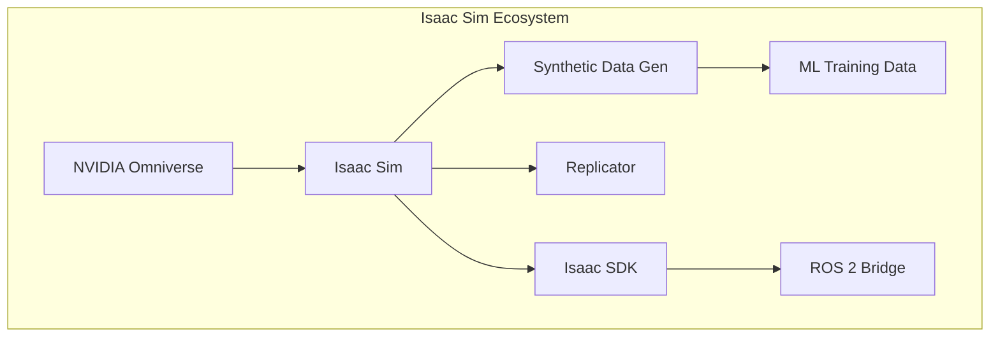

# NVIDIA Isaac Sim: Synthetic Data Generation

:::tip Learning Objective
Use Isaac Sim to generate high-quality synthetic training data for robot perception models.
:::

## What is Isaac Sim?

**NVIDIA Isaac Sim** is a robotics simulation platform built on Omniverse:



| Feature | Gazebo | Isaac Sim |
|---------|--------|-----------|
| Physics | DART/ODE | PhysX 5 |
| Rendering | OGRE | RTX Ray Tracing |
| Synthetic Data | Basic | Replicator |
| GPU Acceleration | Limited | Full |
| Cost | Free | Free (Workstation) |

## Installation

### System Requirements

| Component | Minimum | Recommended |
|-----------|---------|-------------|
| GPU | RTX 2070 | RTX 4090 |
| VRAM | 8 GB | 24 GB |
| RAM | 32 GB | 64 GB |
| Storage | 50 GB SSD | 100 GB NVMe |

```bash
# Install via Omniverse Launcher
# 1. Download Omniverse Launcher from NVIDIA
# 2. Install Isaac Sim from the Exchange tab
# 3. Launch Isaac Sim

# ROS 2 workspace for Isaac ROS
mkdir -p ~/isaac_ros_ws/src
cd ~/isaac_ros_ws/src
git clone https://github.com/NVIDIA-ISAAC-ROS/isaac_ros_common.git
```

## Synthetic Data Generation

### Domain Randomization

Generate diverse training data by randomizing:

```python
# Isaac Sim Python API
import omni.replicator.core as rep

with rep.new_layer():
    # Randomize lighting
    light = rep.create.light(
        light_type="dome",
        rotation=rep.distribution.uniform((0, 0, 0), (360, 360, 360)),
        intensity=rep.distribution.uniform(500, 2000),
        temperature=rep.distribution.uniform(4500, 7500)
    )
    
    # Randomize camera position
    camera = rep.create.camera()
    with camera:
        rep.modify.pose(
            position=rep.distribution.uniform((-2, -2, 1), (2, 2, 3)),
            look_at=(0, 0, 0)
        )
    
    # Randomize object textures
    cube = rep.create.cube()
    with cube:
        rep.randomizer.texture(
            textures=rep.distribution.choice([
                "wood", "metal", "plastic", "fabric"
            ])
        )
```

### Labeling and Export

```python
import omni.replicator.core as rep

# Create render product
render_product = rep.create.render_product(camera, (1280, 720))

# Setup annotators for ground truth
rgb = rep.AnnotatorRegistry.get_annotator("rgb")
depth = rep.AnnotatorRegistry.get_annotator("distance_to_camera")
bbox_2d = rep.AnnotatorRegistry.get_annotator("bounding_box_2d_tight")
segmentation = rep.AnnotatorRegistry.get_annotator("semantic_segmentation")

rgb.attach([render_product])
depth.attach([render_product])
bbox_2d.attach([render_product])
segmentation.attach([render_product])

# Generate dataset
writer = rep.WriterRegistry.get("BasicWriter")
writer.initialize(
    output_dir="~/synthetic_data",
    rgb=True,
    bounding_box_2d_tight=True,
    semantic_segmentation=True
)
writer.attach([render_product])

# Run randomization and capture
for i in range(1000):
    rep.orchestrator.step()
```

## Robot Import and Setup

### URDF to USD Conversion

```python
from omni.isaac.urdf import _urdf
from omni.isaac.core.utils.stage import add_reference_to_stage

# Import URDF as USD
urdf_interface = _urdf.acquire_urdf_interface()

import_config = _urdf.ImportConfig()
import_config.merge_fixed_joints = True
import_config.fix_base_link = False
import_config.make_default_prim = True
import_config.create_physics_scene = True

result = urdf_interface.parse_urdf(
    "/path/to/robot.urdf",
    import_config
)

urdf_interface.import_robot(
    "/path/to/robot.urdf",
    result,
    import_config,
    "/World/Robot"
)
```

### Joint Control

```python
from omni.isaac.core.articulations import ArticulationView

# Get robot articulation
robot = ArticulationView(prim_paths_expr="/World/Robot")
robot.initialize()

# Set joint positions
target_positions = [0.0, -0.5, 1.0, -0.5, 0.0, 0.0]  # Example joint angles
robot.set_joint_position_targets(target_positions)

# Apply torque control
torques = [10.0, 20.0, 15.0, 15.0, 5.0, 5.0]
robot.apply_effort(torques)
```

## ROS 2 Integration

```python
# Enable ROS 2 bridge in Isaac Sim
import omni.graph.core as og

# Create ROS 2 publish node
og.Controller.edit(
    {"graph_path": "/World/ROS2_Graph"},
    {
        og.Controller.Keys.CREATE_NODES: [
            ("OnPlaybackTick", "omni.graph.action.OnPlaybackTick"),
            ("ROS2Publisher", "omni.isaac.ros2_bridge.ROS2Publisher"),
        ],
        og.Controller.Keys.CONNECT: [
            ("OnPlaybackTick.outputs:tick", "ROS2Publisher.inputs:execIn"),
        ],
        og.Controller.Keys.SET_VALUES: [
            ("ROS2Publisher.inputs:topicName", "/isaac/joint_states"),
        ],
    }
)
```

:::danger GPU Memory
Isaac Sim is GPU-intensive. Close other GPU applications and monitor VRAM usage:
```bash
nvidia-smi -l 1  # Monitor every second
```
:::

---

**Next**: [Visual SLAM with Isaac ROS →](./02-visual-slam)
