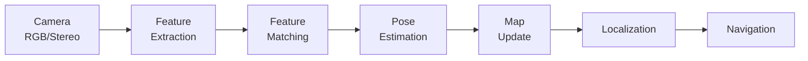
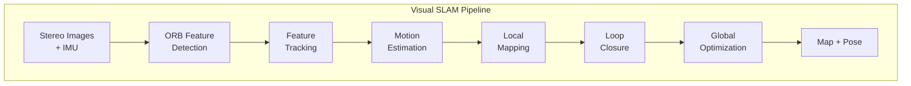

# Visual SLAM with Isaac ROS

:::tip Learning Objective
Implement Visual Simultaneous Localization and Mapping (VSLAM) using Isaac ROS for robot navigation.
:::

## What is Visual SLAM?

**VSLAM** uses camera images to simultaneously:
1. **Build a map** of the environment
2. **Localize** the robot within that map



## Isaac ROS Visual SLAM

NVIDIA provides GPU-accelerated VSLAM:

```bash
# Clone Isaac ROS VSLAM
cd ~/isaac_ros_ws/src
git clone https://github.com/NVIDIA-ISAAC-ROS/isaac_ros_visual_slam.git

# Install dependencies
cd ~/isaac_ros_ws
rosdep install -i -r --from-paths src --rosdistro humble -y

# Build
colcon build --symlink-install --packages-up-to isaac_ros_visual_slam
```

## Configuration

### Camera Setup (Stereo)

```yaml
# config/realsense_stereo.yaml
camera:
  image_width: 640
  image_height: 480
  fps: 30
  
  left_camera:
    topic: /camera/infra1/image_rect_raw
    camera_info: /camera/infra1/camera_info
    
  right_camera:
    topic: /camera/infra2/image_rect_raw
    camera_info: /camera/infra2/camera_info
```

### VSLAM Parameters

```yaml
# config/vslam_params.yaml
visual_slam_node:
  ros__parameters:
    # Input configuration
    use_sim_time: true
    enable_imu_fusion: true
    
    # Feature detection
    num_features: 1000
    enable_debug_mode: false
    
    # Output topics
    map_frame: "map"
    odom_frame: "odom"
    base_frame: "base_link"
    
    # Performance
    enable_localization_n_mapping: true
    publish_map_to_odom_tf: true
```

## Launch File

```python
# launch/vslam.launch.py
from launch import LaunchDescription
from launch_ros.actions import Node
from launch.actions import DeclareLaunchArgument
from launch.substitutions import LaunchConfiguration

def generate_launch_description():
    return LaunchDescription([
        DeclareLaunchArgument('use_sim_time', default_value='true'),
        
        # Isaac ROS Visual SLAM
        Node(
            package='isaac_ros_visual_slam',
            executable='visual_slam_node',
            name='visual_slam',
            parameters=[{
                'use_sim_time': LaunchConfiguration('use_sim_time'),
                'enable_imu_fusion': True,
                'enable_debug_mode': False,
            }],
            remappings=[
                ('stereo_camera/left/image', '/camera/infra1/image_rect_raw'),
                ('stereo_camera/right/image', '/camera/infra2/image_rect_raw'),
                ('stereo_camera/left/camera_info', '/camera/infra1/camera_info'),
                ('stereo_camera/right/camera_info', '/camera/infra2/camera_info'),
                ('visual_slam/imu', '/imu/data'),
            ]
        ),
        
        # Visualization
        Node(
            package='rviz2',
            executable='rviz2',
            arguments=['-d', 'config/vslam.rviz']
        ),
    ])
```

## Processing SLAM Output

```python
#!/usr/bin/env python3
"""
SLAM Data Processor
Process VSLAM output for navigation.
"""

import rclpy
from rclpy.node import Node
from nav_msgs.msg import Odometry, OccupancyGrid
from geometry_msgs.msg import PoseStamped
from isaac_ros_visual_slam_interfaces.srv import GetAllPoses

class SLAMProcessor(Node):
    def __init__(self):
        super().__init__('slam_processor')
        
        # Subscribe to odometry from VSLAM
        self.odom_sub = self.create_subscription(
            Odometry,
            '/visual_slam/tracking/odometry',
            self.odom_callback,
            10
        )
        
        # Subscribe to map
        self.map_sub = self.create_subscription(
            OccupancyGrid,
            '/map',
            self.map_callback,
            10
        )
        
        # Publisher for current pose
        self.pose_pub = self.create_publisher(
            PoseStamped,
            '/robot_pose',
            10
        )
        
        self.current_map = None
        self.get_logger().info('SLAM Processor ready')
    
    def odom_callback(self, msg: Odometry):
        """Process visual odometry."""
        pose = PoseStamped()
        pose.header = msg.header
        pose.pose = msg.pose.pose
        
        self.pose_pub.publish(pose)
        
        # Log position
        pos = msg.pose.pose.position
        self.get_logger().debug(
            f'Position: ({pos.x:.2f}, {pos.y:.2f}, {pos.z:.2f})'
        )
    
    def map_callback(self, msg: OccupancyGrid):
        """Process incoming map data."""
        self.current_map = msg
        
        self.get_logger().info(
            f'Map received: {msg.info.width}x{msg.info.height}, '
            f'resolution: {msg.info.resolution}m/cell'
        )
```

## VSLAM Pipeline Diagram



## Troubleshooting

| Issue | Solution |
|-------|----------|
| Lost tracking | Slow down robot movement |
| Drift over time | Enable loop closure |
| Poor features | Improve lighting |
| High latency | Reduce image resolution |

:::danger Motion Blur
Rapid movements cause motion blur, breaking feature tracking. Limit robot velocity during SLAM initialization:
```python
max_linear_velocity = 0.3  # m/s
max_angular_velocity = 0.5  # rad/s
```
:::

---

**Next**: [Nav2 for Bipedal Path Planning →](./03-nav2-navigation)
