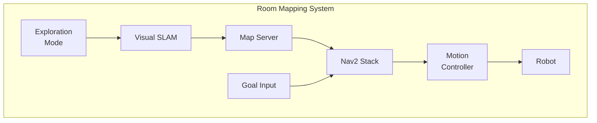
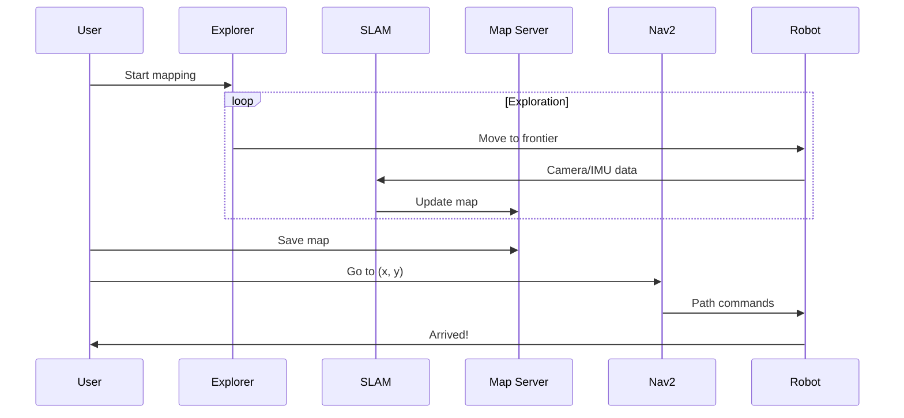
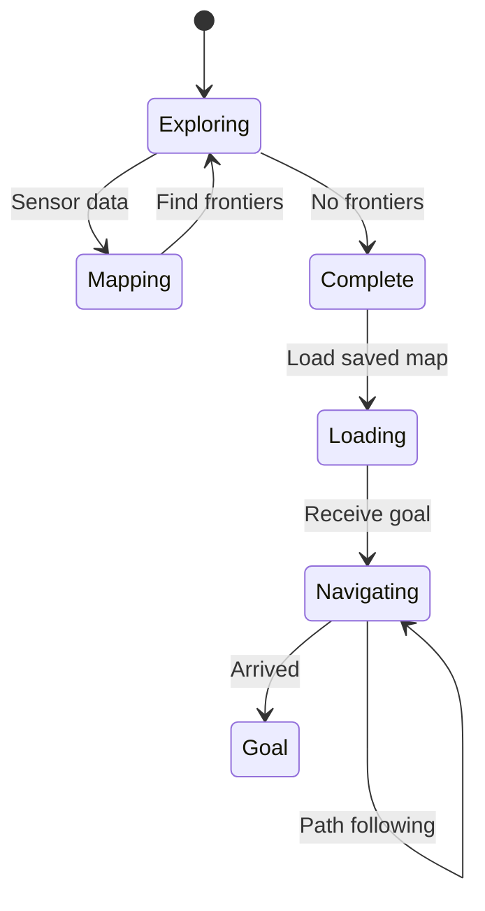

# Deliverable: Room Mapping & Navigation

:::tip Learning Objective
Build a complete system where a robot maps a room and navigates from point A to point B.
:::

## Project Overview

Create a robot that:
1. ✅ Explores and maps an unknown room (SLAM)
2. ✅ Saves the map for future use
3. ✅ Navigates to user-specified goals
4. ✅ Avoids dynamic obstacles



## System Architecture



## Step 1: Create the Mapping Node

```python
#!/usr/bin/env python3
"""
Room Mapper Node
Autonomous exploration and mapping.
"""

import rclpy
from rclpy.node import Node
from nav_msgs.msg import OccupancyGrid, Odometry
from geometry_msgs.msg import PoseStamped, Twist
from nav2_msgs.action import NavigateToPose
from rclpy.action import ActionClient
import numpy as np

class RoomMapper(Node):
    def __init__(self):
        super().__init__('room_mapper')
        
        # Subscribers
        self.map_sub = self.create_subscription(
            OccupancyGrid, '/map', self.map_callback, 10
        )
        self.odom_sub = self.create_subscription(
            Odometry, '/odom', self.odom_callback, 10
        )
        
        # Publishers
        self.cmd_pub = self.create_publisher(Twist, '/cmd_vel', 10)
        
        # Action client for navigation
        self.nav_client = ActionClient(self, NavigateToPose, 'navigate_to_pose')
        
        # State
        self.current_map = None
        self.current_pose = None
        self.frontiers = []
        self.is_exploring = True
        
        # Timer for exploration
        self.timer = self.create_timer(2.0, self.explore_step)
        
        self.get_logger().info('🗺️ Room Mapper initialized')
    
    def map_callback(self, msg: OccupancyGrid):
        self.current_map = msg
        self.find_frontiers()
    
    def odom_callback(self, msg: Odometry):
        self.current_pose = msg.pose.pose
    
    def find_frontiers(self):
        """Find exploration frontiers (boundaries between known and unknown)."""
        if self.current_map is None:
            return
        
        width = self.current_map.info.width
        height = self.current_map.info.height
        resolution = self.current_map.info.resolution
        origin = self.current_map.info.origin.position
        
        data = np.array(self.current_map.data).reshape((height, width))
        
        frontiers = []
        
        for y in range(1, height - 1):
            for x in range(1, width - 1):
                # Free cell
                if data[y, x] == 0:
                    # Check neighbors for unknown (-1)
                    neighbors = [
                        data[y-1, x], data[y+1, x],
                        data[y, x-1], data[y, x+1]
                    ]
                    if -1 in neighbors:
                        # This is a frontier!
                        world_x = origin.x + x * resolution
                        world_y = origin.y + y * resolution
                        frontiers.append((world_x, world_y))
        
        self.frontiers = frontiers
        self.get_logger().debug(f'Found {len(frontiers)} frontier cells')
    
    def explore_step(self):
        """Take one exploration step."""
        if not self.is_exploring:
            return
        
        if not self.frontiers:
            self.get_logger().info('🎉 Exploration complete!')
            self.is_exploring = False
            return
        
        # Choose closest frontier
        if self.current_pose:
            robot_x = self.current_pose.position.x
            robot_y = self.current_pose.position.y
            
            closest = min(
                self.frontiers,
                key=lambda f: (f[0] - robot_x)**2 + (f[1] - robot_y)**2
            )
            
            self.navigate_to(closest[0], closest[1])
    
    def navigate_to(self, x: float, y: float):
        """Send navigation goal."""
        if not self.nav_client.wait_for_server(timeout_sec=1.0):
            self.get_logger().warn('Nav2 not available')
            return
        
        goal = NavigateToPose.Goal()
        goal.pose.header.frame_id = 'map'
        goal.pose.header.stamp = self.get_clock().now().to_msg()
        goal.pose.pose.position.x = x
        goal.pose.pose.position.y = y
        goal.pose.pose.orientation.w = 1.0
        
        self.get_logger().info(f'📍 Navigating to ({x:.2f}, {y:.2f})')
        self.nav_client.send_goal_async(goal)
    
    def save_map(self, filename: str):
        """Save current map to file."""
        if self.current_map is None:
            self.get_logger().error('No map to save!')
            return
        
        # Use map_saver service
        import subprocess
        subprocess.run([
            'ros2', 'run', 'nav2_map_server', 'map_saver_cli',
            '-f', filename
        ])
        self.get_logger().info(f'💾 Map saved to {filename}')


def main(args=None):
    rclpy.init(args=args)
    node = RoomMapper()
    
    try:
        rclpy.spin(node)
    except KeyboardInterrupt:
        node.save_map('~/maps/room_map')
    finally:
        node.destroy_node()
        rclpy.shutdown()
```

## Step 2: Navigation Goal Interface

```python
#!/usr/bin/env python3
"""
Navigation Goal Publisher
Send goals via command line.
"""

import rclpy
from rclpy.node import Node
from geometry_msgs.msg import PoseStamped
import sys

class GoalPublisher(Node):
    def __init__(self, x: float, y: float):
        super().__init__('goal_publisher')
        
        self.publisher = self.create_publisher(
            PoseStamped, '/goal_pose', 10
        )
        
        # Publish goal
        goal = PoseStamped()
        goal.header.frame_id = 'map'
        goal.header.stamp = self.get_clock().now().to_msg()
        goal.pose.position.x = x
        goal.pose.position.y = y
        goal.pose.orientation.w = 1.0
        
        # Wait for subscriber
        import time
        time.sleep(1.0)
        
        self.publisher.publish(goal)
        self.get_logger().info(f'🎯 Goal published: ({x}, {y})')


def main():
    if len(sys.argv) != 3:
        print('Usage: ros2 run room_mapper goto_goal X Y')
        return
    
    x = float(sys.argv[1])
    y = float(sys.argv[2])
    
    rclpy.init()
    node = GoalPublisher(x, y)
    rclpy.spin_once(node)
    node.destroy_node()
    rclpy.shutdown()
```

## Step 3: Launch Everything

```python
# launch/room_mapping.launch.py
from launch import LaunchDescription
from launch.actions import IncludeLaunchDescription
from launch_ros.actions import Node
from launch.launch_description_sources import PythonLaunchDescriptionSource
import os

def generate_launch_description():
    return LaunchDescription([
        # Simulation
        # (Include your Gazebo/Isaac world here)
        
        # SLAM
        Node(
            package='slam_toolbox',
            executable='async_slam_toolbox_node',
            name='slam_toolbox',
            parameters=[{
                'use_sim_time': True,
                'base_frame': 'base_link',
                'odom_frame': 'odom',
                'map_frame': 'map',
            }]
        ),
        
        # Nav2
        IncludeLaunchDescription(
            PythonLaunchDescriptionSource([
                os.path.join(
                    get_package_share_directory('nav2_bringup'),
                    'launch',
                    'navigation_launch.py'
                )
            ]),
            launch_arguments={'use_sim_time': 'true'}.items()
        ),
        
        # Room Mapper
        Node(
            package='room_mapper',
            executable='room_mapper',
            name='room_mapper',
            output='screen'
        ),
    ])
```

## Testing the System

```bash
# Terminal 1: Launch simulation + navigation
ros2 launch room_mapper room_mapping.launch.py

# Terminal 2: Monitor mapping progress
ros2 topic echo /map --once

# Terminal 3: After mapping, send navigation goal
ros2 run room_mapper goto_goal 3.0 2.0

# Save map when done
ros2 run nav2_map_server map_saver_cli -f ~/maps/my_room
```

## Expected Output



:::tip Checkpoint
Success if:
- ✅ Robot autonomously explores room
- ✅ Map shows walls and obstacles
- ✅ Navigation to goals succeeds
- ✅ Map can be saved and reloaded
:::

---

**Module Complete!**

**Next Module**: [Vision-Language-Action (Capstone) →](../04-vision-language-action)
