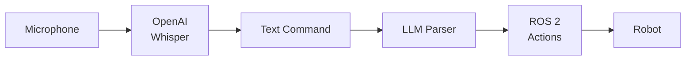
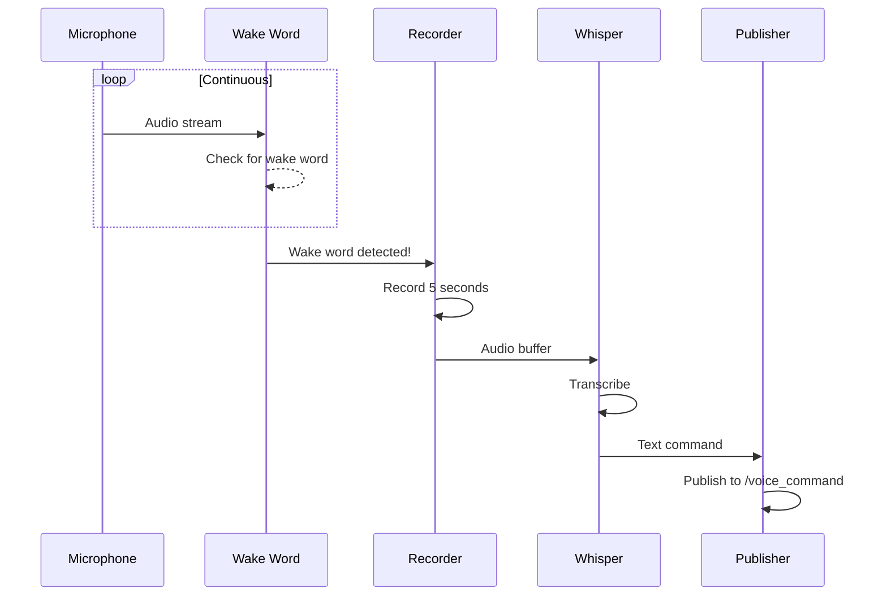

# Voice Pipeline: OpenAI Whisper Integration

:::tip Learning Objective
Build a voice command ingestion pipeline using OpenAI Whisper for robot control.
:::

## Voice-Controlled Robots

Voice is the most natural human interface. We'll create:



## OpenAI Whisper Options

| Deployment | Latency | Cost | Privacy |
|------------|---------|------|---------|
| **Cloud API** | 500ms | Per-minute | Data sent to OpenAI |
| **whisper.cpp** | 200ms | Free | Local |
| **Faster-Whisper** | 150ms | Free | Local |

## Installing Whisper

### Option 1: OpenAI API

```bash
pip install openai
export OPENAI_API_KEY="your-key-here"
```

### Option 2: Local (Faster-Whisper)

```bash
pip install faster-whisper
# Requires: CUDA 11.x for GPU acceleration
```

## ROS 2 Voice Command Node

```python
#!/usr/bin/env python3
"""
Voice Command Node
Transcribe speech and publish as ROS 2 messages.
"""

import rclpy
from rclpy.node import Node
from std_msgs.msg import String
import numpy as np
import sounddevice as sd
from faster_whisper import WhisperModel

class VoiceCommandNode(Node):
    def __init__(self):
        super().__init__('voice_command')
        
        # Parameters
        self.declare_parameter('model_size', 'base.en')
        self.declare_parameter('sample_rate', 16000)
        self.declare_parameter('record_seconds', 5)
        
        model_size = self.get_parameter('model_size').value
        self.sample_rate = self.get_parameter('sample_rate').value
        self.record_seconds = self.get_parameter('record_seconds').value
        
        # Load Whisper model
        self.get_logger().info(f'Loading Whisper model: {model_size}')
        self.model = WhisperModel(model_size, device="cuda", compute_type="float16")
        
        # Publisher
        self.command_pub = self.create_publisher(String, '/voice_command', 10)
        
        # Status publisher
        self.status_pub = self.create_publisher(String, '/voice_status', 10)
        
        # Listen timer
        self.timer = self.create_timer(0.5, self.check_for_speech)
        
        self.is_listening = False
        self.get_logger().info('🎤 Voice Command Node ready')
    
    def record_audio(self) -> np.ndarray:
        """Record audio from microphone."""
        self.publish_status('🎙️ Listening...')
        
        audio = sd.rec(
            int(self.record_seconds * self.sample_rate),
            samplerate=self.sample_rate,
            channels=1,
            dtype='float32'
        )
        sd.wait()
        
        return audio.flatten()
    
    def transcribe(self, audio: np.ndarray) -> str:
        """Transcribe audio using Whisper."""
        self.publish_status('🧠 Transcribing...')
        
        # Write to temp file (faster-whisper requires file)
        import tempfile
        import scipy.io.wavfile as wav
        
        with tempfile.NamedTemporaryFile(suffix='.wav', delete=False) as f:
            wav.write(f.name, self.sample_rate, audio)
            segments, info = self.model.transcribe(f.name)
        
        text = ' '.join(segment.text for segment in segments)
        return text.strip()
    
    def check_for_speech(self):
        """Main listening loop."""
        if self.is_listening:
            return
        
        self.is_listening = True
        
        try:
            # Record audio
            audio = self.record_audio()
            
            # Check if audio has content (not silence)
            if np.abs(audio).max() < 0.01:
                self.publish_status('🔇 No speech detected')
                return
            
            # Transcribe
            text = self.transcribe(audio)
            
            if text:
                self.get_logger().info(f'📝 Transcribed: "{text}"')
                
                # Publish command
                msg = String()
                msg.data = text
                self.command_pub.publish(msg)
                
                self.publish_status(f'✅ Command: {text}')
            else:
                self.publish_status('❌ Could not understand')
        
        finally:
            self.is_listening = False
    
    def publish_status(self, status: str):
        msg = String()
        msg.data = status
        self.status_pub.publish(msg)


def main(args=None):
    rclpy.init(args=args)
    node = VoiceCommandNode()
    
    try:
        rclpy.spin(node)
    except KeyboardInterrupt:
        pass
    finally:
        node.destroy_node()
        rclpy.shutdown()


if __name__ == '__main__':
    main()
```

## Wake Word Detection

Add a wake word before processing full commands:

```python
import pvporcupine

class WakeWordDetector:
    def __init__(self, wake_word="hey robot"):
        # Using Porcupine for wake word
        self.porcupine = pvporcupine.create(
            keywords=[wake_word]
        )
        
    def detect(self, audio_frame: np.ndarray) -> bool:
        keyword_index = self.porcupine.process(audio_frame)
        return keyword_index >= 0
```

## Complete Voice Pipeline



## Configuration File

```yaml
# config/voice_params.yaml
voice_command_node:
  ros__parameters:
    model_size: "base.en"   # Options: tiny, base, small, medium, large
    sample_rate: 16000
    record_seconds: 5
    language: "en"
    use_wake_word: true
    wake_word: "hey robot"
```

:::danger Microphone Access
Ensure your ROS 2 environment has microphone permissions:
```bash
# Linux: Add user to audio group
sudo usermod -a -G audio $USER
# Then log out and back in
```
:::

---

**Next**: [Cognitive Logic with LLMs →](./02-cognitive-logic)
