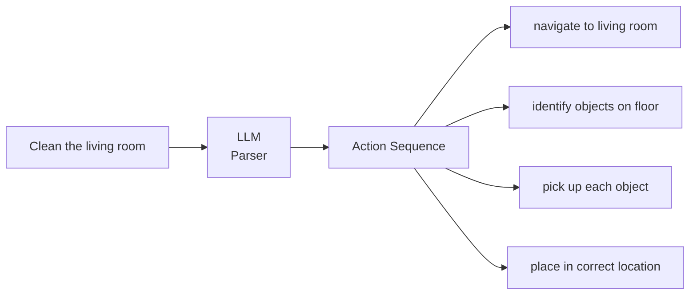

# Cognitive Logic: LLM to ROS 2 Action Sequences

:::tip Learning Objective
Use Large Language Models to parse natural language commands into executable ROS 2 action sequences.
:::

## The Language-Action Gap

Humans speak in **intentions**. Robots need **actions**.



## LLM as Robot Planner

### System Prompt Engineering

```python
ROBOT_PLANNER_PROMPT = """
You are a robot action planner. Convert natural language commands into ROS 2 action sequences.

Available actions:
- navigate_to(location: str) - Move robot to location
- pick_up(object: str) - Grasp an object
- place_at(location: str) - Place held object
- look_at(target: str) - Turn camera towards target
- speak(message: str) - Say something
- wait(seconds: float) - Pause execution

Locations: kitchen, living_room, bedroom, bathroom, entrance
Objects: cup, bottle, book, remote, phone, toy

Respond with a JSON array of actions. Example:
[
  {"action": "navigate_to", "params": {"location": "kitchen"}},
  {"action": "pick_up", "params": {"object": "cup"}},
  {"action": "navigate_to", "params": {"location": "living_room"}},
  {"action": "place_at", "params": {"location": "table"}}
]

If the command is unclear or impossible, respond with:
{"error": "explanation of why this cannot be done"}
"""
```

### LLM Parser Node

```python
#!/usr/bin/env python3
"""
LLM Action Parser
Convert natural language to ROS 2 actions.
"""

import rclpy
from rclpy.node import Node
from std_msgs.msg import String
import json
from openai import OpenAI

class LLMActionParser(Node):
    def __init__(self):
        super().__init__('llm_action_parser')
        
        # OpenAI client
        self.client = OpenAI()
        
        # Subscribers
        self.command_sub = self.create_subscription(
            String, '/voice_command', self.parse_command, 10
        )
        
        # Publisher for action sequences
        self.action_pub = self.create_publisher(
            String, '/action_sequence', 10
        )
        
        # System prompt
        self.system_prompt = self.load_system_prompt()
        
        self.get_logger().info('🧠 LLM Action Parser ready')
    
    def load_system_prompt(self) -> str:
        return """
You are a robot action planner for a humanoid robot.
Convert natural language commands into ROS 2 action sequences.

Available actions:
- navigate_to(location: str)
- pick_up(object: str) 
- place_at(location: str)
- look_at(target: str)
- speak(message: str)
- wait(seconds: float)

Respond ONLY with valid JSON array of actions.
"""
    
    def parse_command(self, msg: String):
        """Parse voice command using LLM."""
        command = msg.data
        self.get_logger().info(f'🎯 Parsing: "{command}"')
        
        try:
            response = self.client.chat.completions.create(
                model="gpt-4",
                messages=[
                    {"role": "system", "content": self.system_prompt},
                    {"role": "user", "content": command}
                ],
                temperature=0.1,  # Low temperature for consistency
                max_tokens=500
            )
            
            result = response.choices[0].message.content
            
            # Validate JSON
            actions = json.loads(result)
            
            if isinstance(actions, list):
                self.get_logger().info(f'📋 Generated {len(actions)} actions')
                
                # Publish action sequence
                action_msg = String()
                action_msg.data = json.dumps(actions)
                self.action_pub.publish(action_msg)
            else:
                self.get_logger().warn(f'LLM returned error: {actions}')
        
        except json.JSONDecodeError as e:
            self.get_logger().error(f'Invalid JSON from LLM: {e}')
        except Exception as e:
            self.get_logger().error(f'LLM API error: {e}')


def main(args=None):
    rclpy.init(args=args)
    node = LLMActionParser()
    rclpy.spin(node)
    node.destroy_node()
    rclpy.shutdown()
```

## Action Executor

```python
#!/usr/bin/env python3
"""
Action Executor
Execute ROS 2 actions from LLM-generated sequences.
"""

import rclpy
from rclpy.node import Node
from rclpy.action import ActionClient
from std_msgs.msg import String
from nav2_msgs.action import NavigateToPose
from geometry_msgs.msg import PoseStamped
import json

class ActionExecutor(Node):
    def __init__(self):
        super().__init__('action_executor')
        
        # Subscriber
        self.seq_sub = self.create_subscription(
            String, '/action_sequence', self.execute_sequence, 10
        )
        
        # Action clients
        self.nav_client = ActionClient(self, NavigateToPose, 'navigate_to_pose')
        
        # Location mapping
        self.locations = {
            'kitchen': (2.0, 3.0),
            'living_room': (0.0, 0.0),
            'bedroom': (-2.0, 3.0),
            'entrance': (0.0, -3.0)
        }
        
        self.get_logger().info('⚡ Action Executor ready')
    
    def execute_sequence(self, msg: String):
        """Execute a sequence of actions."""
        actions = json.loads(msg.data)
        
        self.get_logger().info(f'🚀 Executing {len(actions)} actions')
        
        for i, action in enumerate(actions):
            self.get_logger().info(f'  [{i+1}/{len(actions)}] {action["action"]}')
            
            action_name = action['action']
            params = action.get('params', {})
            
            if action_name == 'navigate_to':
                self.execute_navigate(params['location'])
            elif action_name == 'pick_up':
                self.execute_pick_up(params['object'])
            elif action_name == 'place_at':
                self.execute_place(params['location'])
            elif action_name == 'speak':
                self.execute_speak(params['message'])
            elif action_name == 'wait':
                self.execute_wait(params['seconds'])
            else:
                self.get_logger().warn(f'Unknown action: {action_name}')
    
    def execute_navigate(self, location: str):
        """Navigate to a location."""
        if location not in self.locations:
            self.get_logger().error(f'Unknown location: {location}')
            return
        
        x, y = self.locations[location]
        
        goal = NavigateToPose.Goal()
        goal.pose.header.frame_id = 'map'
        goal.pose.header.stamp = self.get_clock().now().to_msg()
        goal.pose.pose.position.x = x
        goal.pose.pose.position.y = y
        goal.pose.pose.orientation.w = 1.0
        
        self.nav_client.send_goal_async(goal)
        self.get_logger().info(f'📍 Navigating to {location}')
    
    def execute_pick_up(self, object_name: str):
        """Pick up an object (placeholder)."""
        self.get_logger().info(f'🤏 Picking up {object_name}')
        # TODO: Implement manipulation
    
    def execute_place(self, location: str):
        """Place object (placeholder)."""
        self.get_logger().info(f'📦 Placing at {location}')
        # TODO: Implement manipulation
    
    def execute_speak(self, message: str):
        """Text-to-speech."""
        self.get_logger().info(f'🗣️ Speaking: "{message}"')
        # TODO: Integrate TTS
    
    def execute_wait(self, seconds: float):
        """Wait for specified duration."""
        import time
        self.get_logger().info(f'⏳ Waiting {seconds}s')
        time.sleep(seconds)
```

## Example Interactions

| Voice Command | LLM Output |
|---------------|------------|
| "Go to the kitchen" | `[{"action": "navigate_to", "params": {"location": "kitchen"}}]` |
| "Bring me a cup from the kitchen" | `[{"action": "navigate_to", "params": {"location": "kitchen"}}, {"action": "pick_up", "params": {"object": "cup"}}, {"action": "navigate_to", "params": {"location": "living_room"}}, {"action": "place_at", "params": {"location": "table"}}]` |
| "Say hello and wave" | `[{"action": "speak", "params": {"message": "Hello!"}}, {"action": "wave"}]` |

:::danger Safety Considerations
Always validate LLM outputs before execution:
```python
def validate_action(action):
    allowed_actions = ['navigate_to', 'pick_up', 'speak', 'wait']
    if action['action'] not in allowed_actions:
        raise ValueError(f"Unsafe action: {action['action']}")
```
:::

---

**Next**: [The Autonomous Humanoid (Capstone) →](./03-autonomous-humanoid)
