# Capstone: The Autonomous Humanoid

:::tip Learning Objective
Build a complete system where a voice command triggers path planning, object identification, and manipulation.
:::

## Capstone Overview

This project integrates **everything** you've learned:

```mermaid
graph TB
    subgraph "The Autonomous Humanoid"
        VOICE[🎤 Voice Input] --> WHISPER[Whisper<br/>Transcription]
        WHISPER --> LLM[GPT-4<br/>Action Planning]
        LLM --> EXEC[Action<br/>Executor]
        
        EXEC --> NAV[Nav2<br/>Navigation]
        EXEC --> PERCEP[Vision<br/>Perception]
        EXEC --> MANIP[Manipulation<br/>Controller]
        
        NAV --> ROBOT[🤖 Robot]
        PERCEP --> ROBOT
        MANIP --> ROBOT
        
        ROBOT --> SENSORS[Sensors]
        SENSORS --> SLAM[SLAM]
        SLAM --> NAV
    end
```



## System Requirements

| Component | Implementation |
|-----------|---------------|
| **Voice Input** | Whisper (local or API) |
| **Language Understanding** | GPT-4 / Claude |
| **Navigation** | Nav2 + SLAM |
| **Perception** | YOLO v8 / Isaac Perceptor |
| **Manipulation** | MoveIt 2 |
| **Simulation** | Gazebo / Isaac Sim |

## Complete System Architecture

```python
#!/usr/bin/env python3
"""
Autonomous Humanoid - Main Controller
======================================
Orchestrates all subsystems for voice-controlled autonomous operation.
"""

import rclpy
from rclpy.node import Node
from rclpy.action import ActionClient
from rclpy.callback_groups import ReentrantCallbackGroup
from rclpy.executors import MultiThreadedExecutor

from std_msgs.msg import String
from sensor_msgs.msg import Image
from geometry_msgs.msg import PoseStamped
from nav2_msgs.action import NavigateToPose
from vision_msgs.msg import Detection2DArray

import json
from enum import Enum, auto

class RobotState(Enum):
    IDLE = auto()
    LISTENING = auto()
    PLANNING = auto()
    NAVIGATING = auto()
    SEARCHING = auto()
    MANIPULATING = auto()
    SPEAKING = auto()
    ERROR = auto()

class AutonomousHumanoid(Node):
    """
    Main controller for the autonomous humanoid robot.
    Integrates voice, navigation, perception, and manipulation.
    """
    
    def __init__(self):
        super().__init__('autonomous_humanoid')
        
        # Callback group for concurrent execution
        self.cb_group = ReentrantCallbackGroup()
        
        # === STATE ===
        self.state = RobotState.IDLE
        self.current_task = None
        self.held_object = None
        
        # === SUBSCRIBERS ===
        self.voice_sub = self.create_subscription(
            String, '/voice_command', self.on_voice_command, 10,
            callback_group=self.cb_group
        )
        
        self.action_sub = self.create_subscription(
            String, '/action_sequence', self.on_action_sequence, 10,
            callback_group=self.cb_group
        )
        
        self.detection_sub = self.create_subscription(
            Detection2DArray, '/detections', self.on_detections, 10,
            callback_group=self.cb_group
        )
        
        # === PUBLISHERS ===
        self.status_pub = self.create_publisher(String, '/robot_status', 10)
        self.tts_pub = self.create_publisher(String, '/tts_input', 10)
        
        # === ACTION CLIENTS ===
        self.nav_client = ActionClient(
            self, NavigateToPose, 'navigate_to_pose',
            callback_group=self.cb_group
        )
        
        # === LOCATIONS ===
        self.locations = {
            'kitchen': {'x': 2.0, 'y': 3.0, 'yaw': 0.0},
            'living_room': {'x': 0.0, 'y': 0.0, 'yaw': 0.0},
            'bedroom': {'x': -2.0, 'y': 3.0, 'yaw': 1.57},
            'bathroom': {'x': -2.0, 'y': -2.0, 'yaw': 3.14},
            'entrance': {'x': 0.0, 'y': -3.0, 'yaw': -1.57}
        }
        
        # === KNOWN OBJECTS ===
        self.known_objects = {}
        
        self.get_logger().info('🤖 Autonomous Humanoid initialized')
        self.speak("Hello! I am ready to assist you.")
        self.set_state(RobotState.IDLE)
    
    # ==================
    # STATE MANAGEMENT
    # ==================
    
    def set_state(self, state: RobotState):
        self.state = state
        self.publish_status(f"State: {state.name}")
        self.get_logger().info(f'📊 State → {state.name}')
    
    def publish_status(self, status: str):
        msg = String()
        msg.data = status
        self.status_pub.publish(msg)
    
    # ==================
    # VOICE HANDLING
    # ==================
    
    def on_voice_command(self, msg: String):
        """Handle incoming voice command."""
        if self.state != RobotState.IDLE:
            self.speak("I'm busy right now. Please wait.")
            return
        
        command = msg.data
        self.get_logger().info(f'🎤 Voice command: "{command}"')
        self.set_state(RobotState.PLANNING)
        
        # Command is forwarded to LLM parser by voice pipeline
        # We wait for action sequence on /action_sequence
    
    def on_action_sequence(self, msg: String):
        """Execute action sequence from LLM."""
        try:
            actions = json.loads(msg.data)
            self.current_task = actions
            self.execute_next_action()
        except json.JSONDecodeError:
            self.get_logger().error('Invalid action sequence')
            self.set_state(RobotState.ERROR)
    
    # ==================
    # ACTION EXECUTION
    # ==================
    
    def execute_next_action(self):
        """Execute the next action in the sequence."""
        if not self.current_task:
            self.speak("Task completed!")
            self.set_state(RobotState.IDLE)
            return
        
        action = self.current_task.pop(0)
        action_name = action['action']
        params = action.get('params', {})
        
        self.get_logger().info(f'⚡ Executing: {action_name}')
        
        if action_name == 'navigate_to':
            self.navigate_to(params['location'])
        elif action_name == 'pick_up':
            self.pick_up(params['object'])
        elif action_name == 'place_at':
            self.place_at(params['location'])
        elif action_name == 'look_at':
            self.look_at(params['target'])
        elif action_name == 'speak':
            self.speak(params['message'])
            self.execute_next_action()  # Non-blocking
        elif action_name == 'wait':
            self.wait_and_continue(params['seconds'])
        else:
            self.get_logger().warn(f'Unknown action: {action_name}')
            self.execute_next_action()
    
    # ==================
    # NAVIGATION
    # ==================
    
    def navigate_to(self, location: str):
        """Navigate to a named location."""
        self.set_state(RobotState.NAVIGATING)
        
        if location not in self.locations:
            self.speak(f"I don't know where {location} is.")
            self.set_state(RobotState.ERROR)
            return
        
        loc = self.locations[location]
        
        goal = NavigateToPose.Goal()
        goal.pose.header.frame_id = 'map'
        goal.pose.header.stamp = self.get_clock().now().to_msg()
        goal.pose.pose.position.x = loc['x']
        goal.pose.pose.position.y = loc['y']
        goal.pose.pose.orientation.w = 1.0
        
        self.speak(f"Navigating to {location}")
        
        future = self.nav_client.send_goal_async(goal)
        future.add_done_callback(self.on_nav_goal_response)
    
    def on_nav_goal_response(self, future):
        goal_handle = future.result()
        if not goal_handle.accepted:
            self.get_logger().error('Navigation goal rejected')
            self.set_state(RobotState.ERROR)
            return
        
        result_future = goal_handle.get_result_async()
        result_future.add_done_callback(self.on_nav_complete)
    
    def on_nav_complete(self, future):
        self.get_logger().info('📍 Navigation complete')
        self.execute_next_action()
    
    # ==================
    # PERCEPTION
    # ==================
    
    def on_detections(self, msg: Detection2DArray):
        """Process object detections."""
        for detection in msg.detections:
            obj_class = detection.results[0].hypothesis.class_id
            self.known_objects[obj_class] = detection.bbox
    
    def look_at(self, target: str):
        """Turn towards a target."""
        self.set_state(RobotState.SEARCHING)
        
        if target in self.known_objects:
            self.get_logger().info(f'👀 Found {target}')
            self.execute_next_action()
        else:
            self.speak(f"Looking for {target}")
            # TODO: Implement search behavior
            self.execute_next_action()
    
    # ==================
    # MANIPULATION
    # ==================
    
    def pick_up(self, object_name: str):
        """Pick up an object."""
        self.set_state(RobotState.MANIPULATING)
        self.speak(f"Picking up {object_name}")
        
        # TODO: Integrate MoveIt 2
        self.get_logger().info(f'🤏 Picking up {object_name}')
        self.held_object = object_name
        
        # Placeholder delay
        import time
        time.sleep(2.0)
        
        self.execute_next_action()
    
    def place_at(self, location: str):
        """Place held object."""
        self.set_state(RobotState.MANIPULATING)
        
        if not self.held_object:
            self.speak("I'm not holding anything")
            self.execute_next_action()
            return
        
        self.speak(f"Placing {self.held_object}")
        
        # TODO: Integrate MoveIt 2
        self.get_logger().info(f'📦 Placing at {location}')
        self.held_object = None
        
        import time
        time.sleep(2.0)
        
        self.execute_next_action()
    
    # ==================
    # COMMUNICATION
    # ==================
    
    def speak(self, message: str):
        """Text-to-speech output."""
        self.get_logger().info(f'🗣️ "{message}"')
        msg = String()
        msg.data = message
        self.tts_pub.publish(msg)
    
    def wait_and_continue(self, seconds: float):
        """Wait then continue execution."""
        import time
        time.sleep(seconds)
        self.execute_next_action()


def main(args=None):
    rclpy.init(args=args)
    
    node = AutonomousHumanoid()
    executor = MultiThreadedExecutor()
    executor.add_node(node)
    
    try:
        executor.spin()
    except KeyboardInterrupt:
        pass
    finally:
        node.destroy_node()
        rclpy.shutdown()


if __name__ == '__main__':
    main()
```

## Complete Launch File

```python
# launch/autonomous_humanoid.launch.py
from launch import LaunchDescription
from launch_ros.actions import Node
from launch.actions import IncludeLaunchDescription

def generate_launch_description():
    return LaunchDescription([
        # 1. Voice Input
        Node(
            package='vla_capstone',
            executable='voice_command_node',
            name='voice_command'
        ),
        
        # 2. LLM Parser
        Node(
            package='vla_capstone',
            executable='llm_action_parser',
            name='llm_parser'
        ),
        
        # 3. Main Controller
        Node(
            package='vla_capstone',
            executable='autonomous_humanoid',
            name='autonomous_humanoid',
            output='screen'
        ),
        
        # 4. Navigation (Nav2)
        IncludeLaunchDescription(
            # Nav2 launch file
        ),
        
        # 5. Perception
        Node(
            package='yolov8_ros',
            executable='yolov8_node',
            name='object_detector'
        ),
        
        # 6. TTS Output
        Node(
            package='vla_capstone',
            executable='tts_node',
            name='text_to_speech'
        ),
    ])
```

## Testing the Capstone

```bash
# Terminal 1: Launch full system
ros2 launch vla_capstone autonomous_humanoid.launch.py

# Terminal 2: Monitor status
ros2 topic echo /robot_status

# Speak commands:
# "Go to the kitchen and pick up a cup"
# "Bring me the remote from the living room"
# "Check if there's anyone at the entrance"
```

## Expected Behavior


---

## 🎉 Congratulations!

You've completed the **Physical AI & Humanoid Robotics** textbook!

### What You Built

| Module | Deliverable |
|--------|-------------|
| 01: ROS 2 | Hello Robot node |
| 02: Digital Twin | Obstacle-sensing simulation |
| 03: AI-Robot Brain | Room mapping system |
| 04: VLA Capstone | Autonomous Humanoid |

### Next Steps

1. 🚀 Deploy to real hardware
2. 🧪 Add more capabilities (manipulation, multi-robot)
3. 🌐 Contribute to open-source robotics
4. 💼 Apply for Physical AI roles

---

*Built with ❤️ for Panaversity's Future of Work initiative*

*This AI-Native Textbook was designed for learning with Claude and other AI assistants.*
