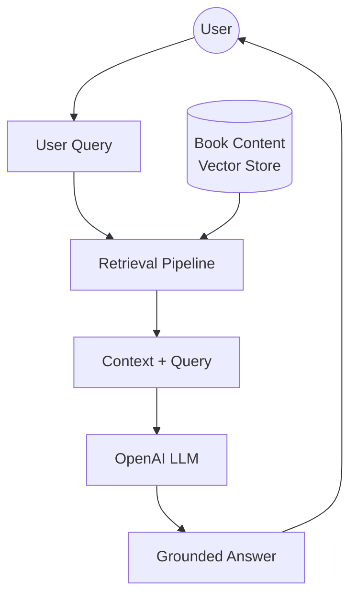

# RAG Architecture: Retrieval-Augmented Generation

:::tip Learning Objective
Understand the core principles and components of a Retrieval-Augmented Generation (RAG) system grounded in textbook content.
:::

## Introduction to RAG

**Retrieval-Augmented Generation (RAG)** is a technique that enhances Large Language Models (LLMs) by retrieving relevant information from a specific knowledge base before generating a response. For our humanoid assistant, this means answering questions based *strictly* on the curriculum content.

## Why RAG for Physical AI?

1.  **Factual Accuracy**: Prevents LLM hallucinations regarding ROS 2 commands or hardware safety.
2.  **Domain Specialization**: Tailors the humanoid assistant's knowledge to the specific modules of this textbook.
3.  **Traceability**: Allows referencing the exact source documents from which an answer was derived.

## Core Components

### 1. Ingestion Pipeline
The process of converting raw textbook MDX files into searchable mathematical representations (embeddings).

- **Chunking**: Breaking long chapters into smaller, manageable pieces.
- **Embedding**: Using models like `text-embedding-3-small` to convert text to vectors.
- **Storage**: Saving vectors in a database like **Qdrant**.

### 2. Retrieval Pipeline
Finding the most relevant content for a user's question.

- **Semantic Search**: Using vector similarity (cosine distance) to find meaning-matched content rather than keyword-matched content.
- **Ranking**: Sorting retrieved passages by relevance.

### 3. Generation Pipeline
Constructing the final answer.

- **Augmented Prompting**: Injecting retrieved textbook snippets into the LLM system prompt.
- **Grounded Verification**: Ensuring the LLM only uses provided context to answer.

## Technical Stack

| Component | Technology |
| :--- | :--- |
| **Backend API** | FastAPI |
| **Vector Database** | Qdrant Cloud |
| **Embeddings** | all-MiniLM-L6-v2 (Soft-Coded) |
| **Agent Logic** | OpenAI Agents / ChatKit |
| **Data Logs** | Neon Serverless Postgres |

:::danger Hardware Safety
A RAG chatbot for robotics must be strictly grounded. Hallucinating a motor voltage or a coordinate transform could lead to physical hardware damage.
:::

---

**Next**: [Data Ingestion & Vectorization →](./02-data-ingestion)
