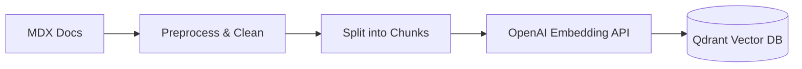

# Data Ingestion & Vectorization

:::tip Learning Objective
Learn how to preprocess MDX textbook content and store it in a Qdrant vector database using OpenAI embeddings.
:::

## The Ingestion Workflow

To make the textbook searchable, we must "convert" it into numbers.



## 1. Preprocessing MDX

Textbook content contains code blocks, Mermaid diagrams, and Docusaurus admonitions. We need to extract the meaningful text.

```python
import os
import re

def clean_mdx(content):
    # Remove Docusaurus imports and frontmatter
    content = re.sub(r'---.*?---', '', content, flags=re.DOTALL)
    content = re.sub(r'import.*?from.*?;', '', content)
    
    # Remove HTML-like tags
    content = re.sub(r'<[^>]+>', '', content)
    
    return content.strip()
```

## 2. Chunking Content

We split files into 500-1000 character chunks so the LLM gets specific, relevant context.

```python
def chunk_text(text, chunk_size=800, overlap=100):
    chunks = []
    for i in range(0, len(text), chunk_size - overlap):
        chunks.append(text[i:i + chunk_size])
    return chunks
```

## 3. Vectorization with OpenAI

Using the `openai` Python SDK to generate embeddings:

```python
from openai import OpenAI

client = OpenAI()

def get_embedding(text):
    response = client.embeddings.create(
        model="text-embedding-3-small",
        input=text
    )
    return response.data[0].embedding
```

## 4. Storing in Qdrant

**Qdrant** is a high-performance vector database optimized for semantic search.

```python
from qdrant_client import QdrantClient
from qdrant_client.models import Distance, VectorParams, PointStruct

# Initialize client
q_client = QdrantClient("localhost", port=6333)

# Create collection
q_client.create_collection(
    collection_name="humanoid_textbook",
    vectors_config=VectorParams(size=1536, distance=Distance.COSINE),
)

# Upload chunks
def upload_chunk(chunk, chunk_id, metadata):
    vector = get_embedding(chunk)
    q_client.upsert(
        collection_name="humanoid_textbook",
        points=[
            PointStruct(
                id=chunk_id,
                vector=vector,
                payload={"text": chunk, "metadata": metadata}
            )
        ]
    )
```

:::tip Implementation Tip
When storing in Qdrant, always include the file path or chapter title in the `payload`. This helps the assistant cite its sources!
:::

## Complete Ingestion Script

```python
import glob

def ingest_all_docs():
    docs = glob.glob("docs/**/*.md", recursive=True)
    for i, doc_path in enumerate(docs):
        with open(doc_path, 'r', encoding='utf-8') as f:
            content = f.read()
            cleaned = clean_mdx(content)
            chunks = chunk_text(cleaned)
            
            for j, chunk in enumerate(chunks):
                upload_chunk(
                    chunk, 
                    chunk_id=f"{i}_{j}", 
                    metadata={"source": doc_path}
                )
    print("Ingestion complete!")
```

---

**Next**: [Query Processing & Retrieval →](./03-query-processing)
