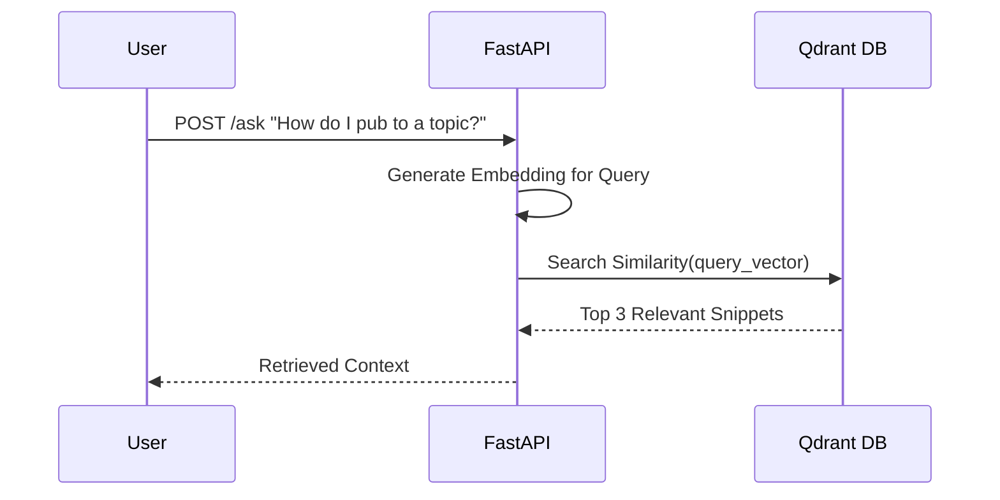

# Query Processing & Retrieval

:::tip Learning Objective
Implement semantic search using Qdrant and expose it via a FastAPI backend for real-time retrieval.
:::

## The Retrieval Logic

When a user asks "How do I move a robot in ROS 2?", the system doesn't search for those exact words. It searches for **meaning**.



## 1. Fast API Retrieval Endpoint

FastAPI provides the high-performance interface for our RAG backend.

```python
from fastapi import FastAPI
from pydantic import BaseModel

app = FastAPI()

class Query(BaseModel):
    text: str

@app.post("/retrieve")
async def retrieve_context(query: Query):
    # 1. Embed user query
    query_vector = get_embedding(query.text)
    
    # 2. Search Qdrant
    results = q_client.search(
        collection_name="humanoid_textbook",
        query_vector=query_vector,
        limit=3
    )
    
    # 3. Format context
    context = "\n---\n".join([r.payload["text"] for r in results])
    return {"context": context, "sources": [r.payload["metadata"] for r in results]}
```

## 2. Semantic Ranking

Semantic search in Qdrant uses **Cosine Similarity**. Scores closer to `1.0` indicate higher relevance.

| Score | Match Quality |
| :--- | :--- |
| `0.85+` | Excellent match (direct answer found) |
| `0.70 - 0.85` | Good match (related topic found) |
| `< 0.70` | Low relevance (fallback needed) |

## 3. Handling Multiple Modules

We can filter searches by module to improve accuracy:

```python
def search_in_module(query_text, module_name):
    query_vector = get_embedding(query_text)
    return q_client.search(
        collection_name="humanoid_textbook",
        query_vector=query_vector,
        query_filter=Filter(
            must=[FieldCondition(key="metadata.module", match=MatchValue(value=module_name))]
        ),
        limit=3
    )
```

## 4. Testing Retrieval Accuracy

Check if your system correctly identifies core concepts:

:::tip Verification Check
Try querying: *"What is a ROS 2 Action?"*
If the system retrieves `/docs/01-robotic-nervous-system/01-ros2-architecture.md`, your semantic search is working correctly!
:::

```python
# Simple Test Script
test_query = "humanoid robot safety"
results = q_client.search(
    collection_name="humanoid_textbook",
    query_vector=get_embedding(test_query),
    limit=1
)
print(f"Top Source: {results[0].payload['metadata']['source']}")
```

---

**Next**: [Answer Generation & Chatbot Integration →](./04-chatbot-integration)
