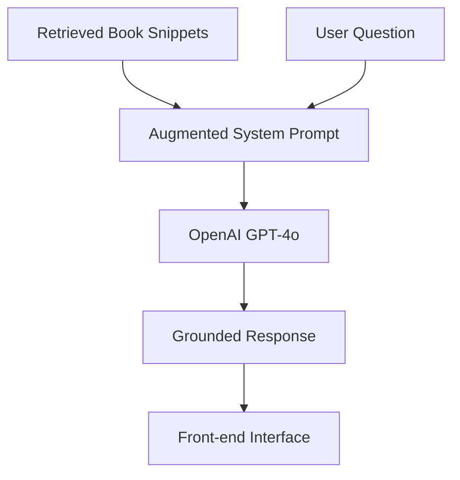

# Answer Generation & Chatbot Integration

:::tip Learning Objective
Generate grounded responses using OpenAI models and connect the RAG backend to a front-end interface.
:::

## The Grounded Generation Loop

The final step is to ask the LLM to answer *only* using the retrieved textbook content.



## 1. Prompt Engineering for Grounding

A strict system prompt is essential to prevent the chatbot from using external (and potentially outdated) robotics knowledge.

```python
SYSTEM_PROMPT = """
You are the Physical AI Textbook Assistant. 
Answer user questions STRICTLY using the provided context from the textbook.

Rules:
1. If the answer is not in the context, say "I'm sorry, that specific information is not covered in the textbook."
2. Do not use outside knowledge.
3. Cite the source provided in metadata.
4. Format code snippets in ROS 2 compatible Python or C++ as shown in the book.

Context:
{context}
"""
```

## 2. The Final RAG Endpoint

```python
@app.post("/ask")
async def ask_chatbot(query: Query):
    # 1. Retrieve context (from Chapter 3)
    retrieval_data = await retrieve_context(query)
    context = retrieval_data["context"]
    
    # 2. Generate response via OpenAI
    response = client.chat.completions.create(
        model="gpt-4o",
        messages=[
            {"role": "system", "content": SYSTEM_PROMPT.format(context=context)},
            {"role": "user", "content": query.text}
        ]
    )
    
    answer = response.choices[0].message.content
    return {"answer": answer, "sources": retrieval_data["sources"]}
```

## 3. Connecting to the UI

You can integrate this API into your Docusaurus site using a custom React component.

```javascript
// src/components/Chatbot.js
import React, { useState } from 'react';

export default function Chatbot() {
  const [question, setQuestion] = useState("");
  const [answer, setAnswer] = useState("");

  const handleAsk = async () => {
    const res = await fetch('http://localhost:8000/ask', {
      method: 'POST',
      headers: {'Content-Type': 'application/json'},
      body: JSON.stringify({text: question})
    });
    const data = await res.json();
    setAnswer(data.answer);
  };

  return (
    <div className="chatbot-container">
      <input 
        type="text" 
        value={question} 
        onChange={(e) => setQuestion(e.target.value)}
        placeholder="Ask the textbook..."
      />
      <button onClick={handleAsk}>Ask AI</button>
      <div className="answer-box">{answer}</div>
    </div>
  );
}
```

## 4. Deliverable: The Autonomous Assistant

The final deliverable is a functional pipeline where:
- ✅ **Ingestion**: Book content is synced to Qdrant.
- ✅ **Retrieval**: Semantic similarity finds relevant chapters.
- ✅ **Safety**: Answers are grounded in actual book lessons.
- ✅ **Experience**: Learners can query "How do I build a lidar-avoiding robot?" and get a step-by-step guide based on Module 02.

:::tip Final Check
Test the assistant with a complex query like: 
*"Explain the relationship between the ROS 2 nervous system and the digital twin."*
A successful response will synthesize content from both Module 01 and Module 02!
:::

---

**Module Complete!** 

**Back to**: [Main Introduction →](../intro)
