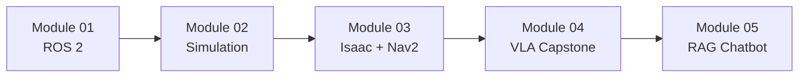

# Physical AI & Humanoid Robotics

Welcome to the **AI-Native Textbook on Physical AI & Humanoid Robotics**. This curriculum prepares you for the Future of Work, where humans, AI agents, and physical robots collaborate as partners.

:::tip AI-Native Learning
This textbook is designed for learning with AI assistants like Claude. Use your AI partner to clarify concepts, debug code, and extend your understanding!
:::

## 🎯 What You'll Build

| Module | Deliverable |
|--------|-------------|
| **01: ROS 2** | "Hello Robot" node with URDF model |
| **02: Digital Twin** | Obstacle-sensing simulation |
| **03: AI-Robot Brain** | Room mapping & navigation system |
| **04: VLA Capstone** | Voice-controlled autonomous humanoid |
| **05: RAG Chatbot** | Retrieval-Augmented Humanoid Assistant |

## 📚 Curriculum Overview



### Module 01: The Robotic Nervous System (ROS 2)

Establish the middleware foundation for robot control.

- ROS 2 Architecture: Nodes, Topics, Services, Actions
- Python Bridging with `rclpy`
- URDF: Defining robot anatomy
- **Deliverable**: Functional "Hello Robot" node

### Module 02: The Digital Twin (Gazebo & Unity)

Master physics simulation and high-fidelity environment building.

- Physics Engines: Gravity, friction, collision in Gazebo
- Unity for human-robot interaction scenarios
- Sensor Simulation: LiDAR, Depth Cameras, IMU
- **Deliverable**: Obstacle-sensing simulation

### Module 03: The AI-Robot Brain (NVIDIA Isaac)

Implement advanced perception and navigation.

- Isaac Sim: Generating synthetic training data
- Visual SLAM: Mapping and localization
- Nav2: Bipedal path planning
- **Deliverable**: Room mapping and A-to-B navigation

### Module 04: Vision-Language-Action (VLA Capstone)

The convergence of LLMs and Physical Robotics.

- Voice Pipeline: OpenAI Whisper integration
- Cognitive Logic: LLM to ROS 2 action sequences
- **Capstone**: The Autonomous Humanoid

### Module 05: RAG Chatbot (Humanoid Assistant)

Implement a knowledge-grounded conversatonal agent.

- RAG Architecture: Retrieval-Augmented Generation
- Data Ingestion: MDX to Qdrant vector store
- Query Processing: Semantic search with FastAPI
- **Deliverable**: Grounded Humanoid AI Assistant

## 👥 Who This Is For

- **O/A Level Students**: Building foundational understanding
- **Engineering Students**: Deepening technical robotics skills
- **Medical Professionals**: Exploring robotic surgery and assistance
- **Career Changers**: Transitioning to Physical AI roles

## 🛠️ Prerequisites

| Skill | Level |
|-------|-------|
| Python | Intermediate |
| Linux (Ubuntu) | Basic |
| Command line | Comfortable |
| Math (Linear Algebra) | Basic |

## 🚀 Getting Started

```bash
# Recommended setup
Ubuntu 22.04 LTS
ROS 2 Humble
Python 3.10+
NVIDIA GPU (for Isaac Sim)
```

Navigate to **[Module 01: The Robotic Nervous System →](./category/module-01-robotic-nervous-system)** to begin!

---

*Built with ❤️ for Panaversity's Future of Work initiative*
